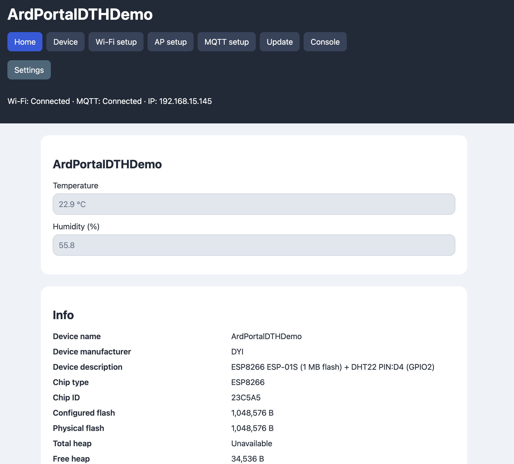
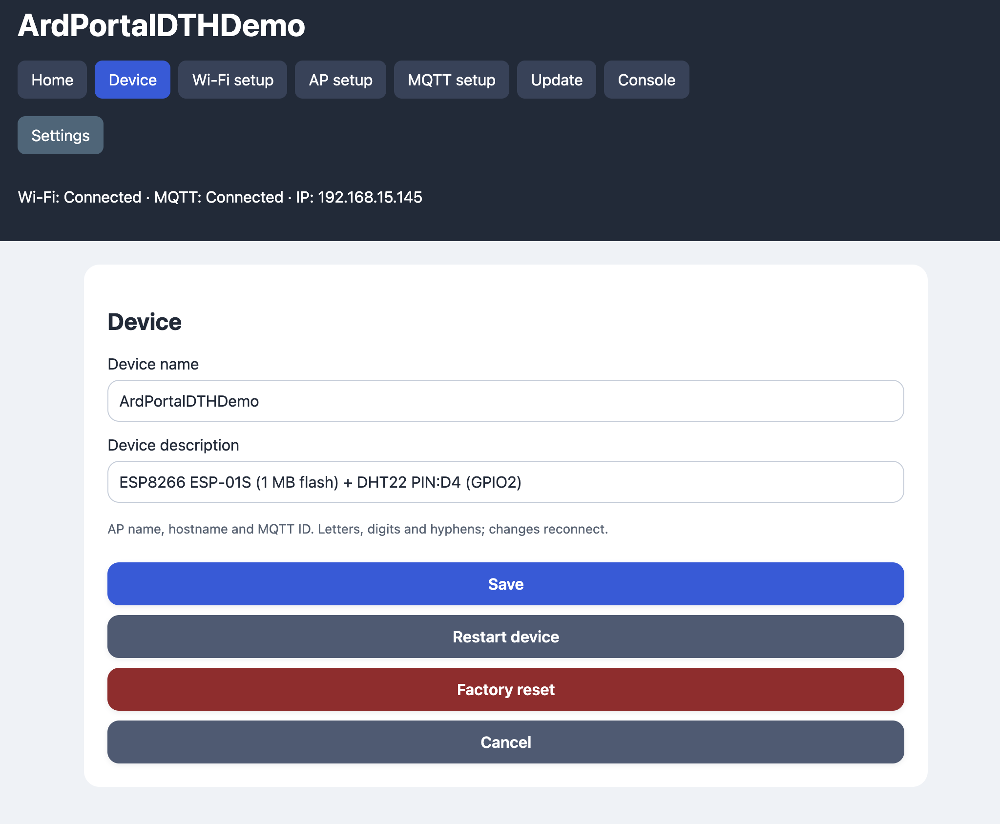
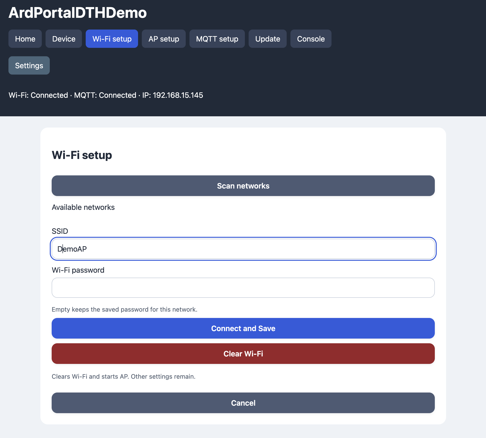
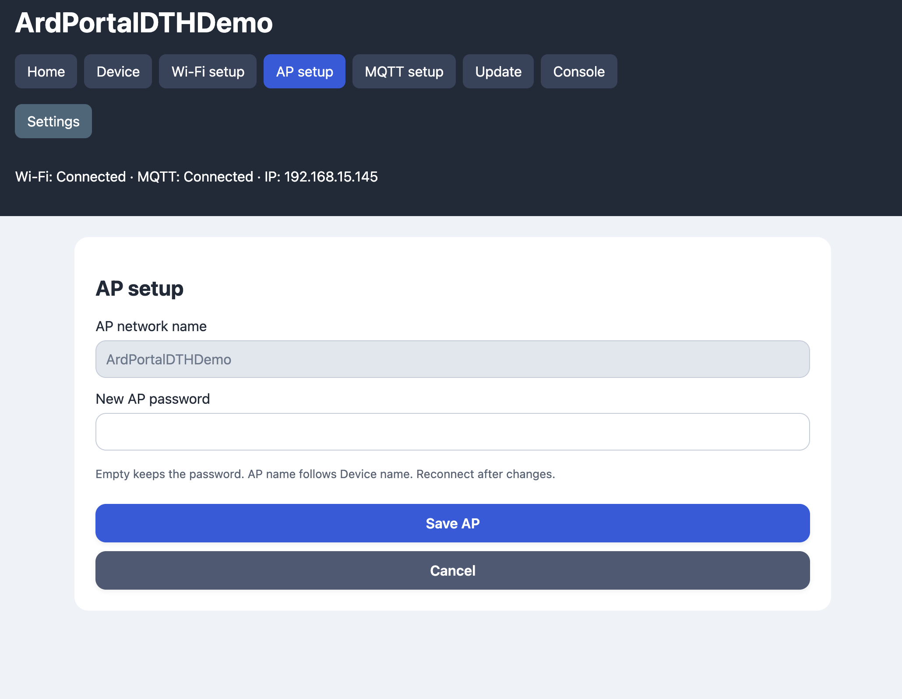
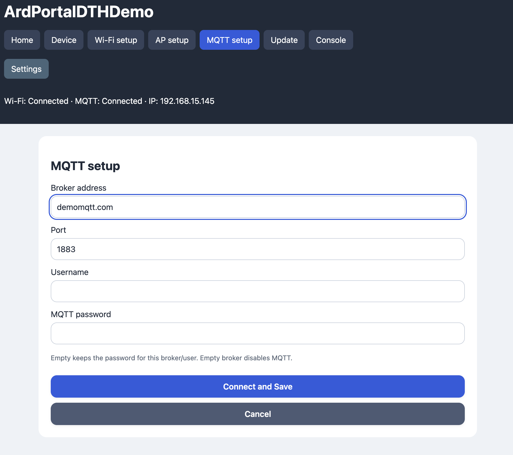
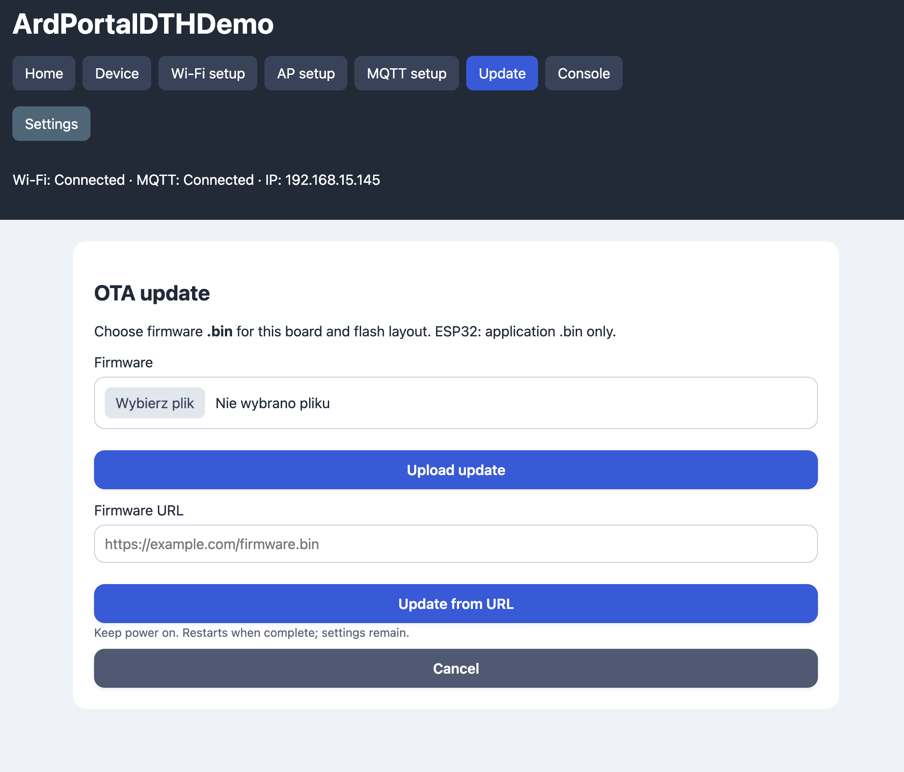
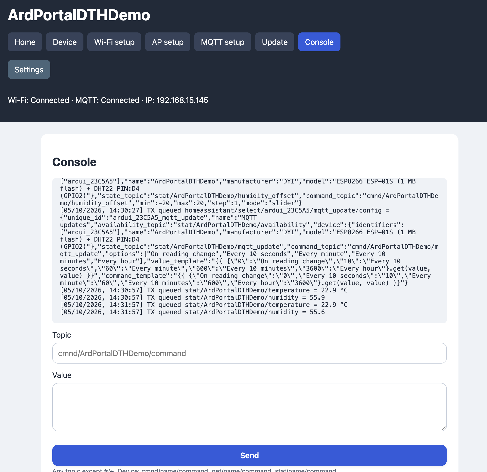
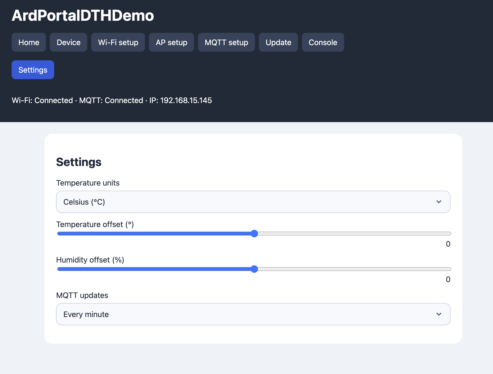

<!-- Author: Radoslaw Kubera (rkubera on GitHub). License: MIT. -->

# ArdPortal

**Default access point (AP) password: `1234567890`.**

A Wi-Fi and MQTT configuration portal for Wi-Fi equipped ESP8266 and ESP32 boards,
with storage and JSON implementations written in this project. The library
requires only the board’s Arduino core; no ESPAsyncTCP, AsyncTCP,
ESPAsyncWebServer or external MQTT library is required.

## Main features

- **Wi-Fi setup:** scan nearby networks, connect to a saved network and start a fallback AP when connection attempts time out. The portal remains accessible after connecting.
- **Captive portal:** configure the device from a browser, with captive DNS for supported operating systems.
- **MQTT:** configure the broker, optionally use verified TLS, publish application data and handle commands.
- **Home Assistant:** automatically publish discovery definitions and synchronize supported controls through MQTT.
- **Dynamic pages:** define forms in JSON, including a Home block, live controls and cascading visibility conditions for fields and pages.
- **Persistent configuration:** store portal and application settings as JSON using ArdFS, with a journal and delayed, coalesced writes to reduce flash wear.
- **Live updates:** synchronize portal controls through WebSockets and inspect or send MQTT messages in the console.
- **Firmware updates:** install firmware from a local file or URL through the OTA page.
- **Device management:** configure the device name and description, set manufacturer metadata from code, view system information, restart or restore factory settings.
- **Time and languages:** synchronize time through NTP and support developer-provided translations with automatic browser language selection.
- **Configurable builds:** disable optional modules and control types with compile-time flags to reduce firmware size.
- **Cooperative operation:** service network and storage work from `loop()`; remaining synchronous core calls are documented.
- **Self-contained library:** includes standalone ArdFS and ArdJSON modules and uses only the ESP Arduino core.

## Developer guide map

- [Feature flags](#optional-modules) and [all 30 control flags](#optional-field-types).
- [Configuration API](#integrated-configuration-api), [Config fields](#portal-configuration-fields), [all portal methods](#public-ardportal-api-reference) and [RAM-only status updates](#persistent-settings-versus-live-status).
- [Dynamic page/field JSON schema](#dynamic-json-schema), [Home](#home-controls-on-start), dependencies/cascades and [all control types](#complete-control-reference).
- [Custom MQTT payloads](#custom-mqtt-payloads-and-reconnect-handling), [Console/OTA](#console-and-ota) and [languages](#languages-and-adding-translations).
- [Standalone ArdFS](#standalone-storage), [storage methods](#ardfs-method-and-result-reference), [LittleFS coexistence](#using-ardfs-alongside-littlefs) and [ArdJSON](#standalone-json-api).
- [All runtime Options](#options-and-remaining-blocking-operations), [maintenance](#verification-and-maintenance) and [MIT license](#license).

## Portal screenshots

Screenshots from the DHT example show the portal and its configuration pages.
Available pages depend on the enabled features.

### Home



<details>
<summary>Device, Wi-Fi, AP, MQTT, update, console and DHT settings</summary>

### Device



### Wi-Fi configuration



### AP configuration



### MQTT configuration



### Update



### MQTT console



### DHT settings



</details>

## Components

ArdPortal owns separate components, each with its own implementation
and state. Its existing public methods delegate to them, so sketches still call
`portal.begin()` and `portal.loop()`.

| Class | Files | Responsibility |
| --- | --- | --- |
| `ArdAppControls` | `ArdAppControls.h / ArdAppControlsImpl.h` | Local dynamic controls, validation, callbacks and optional MQTT command/state/event publication |
| `ArdMqtt` | `ArdMqtt.h / ArdMqttImpl.h` | MQTT framing, TCP/TLS transport, keepalive, reconnect, subscriptions, message callback and connect-before-save trials |
| `ArdHomeAssistant` | `ArdHomeAssistant.h / ArdHomeAssistantImpl.h` | Discovery, availability and dependency-based discovery removal/recreation |
| `ArdOta` | `ArdOta.h / ArdOtaImpl.h` | Firmware upload validation, bounded receive/write steps, Update finalization, interruption cleanup and successful-update restart request |

Access the owned instances with `portal.mqtt()`, `portal.homeAssistant()` and
`portal.ota()`. For example, `portal.mqtt().connected()` reports the broker
connection, and `portal.ota().active()`, `received()` and `expected()` report
firmware upload progress. MQTT offers `publish()`, `subscribe()`, `mqttTopic()`,
`validMqttTopic()`, `state()` and `onMessage()`; they have the same semantics
as the corresponding portal methods. A component callback replaces the same
callback registered through the portal; there is only one message callback.

These are integrated components with a reference to the owning portal, not
standalone clients. The portal supplies configuration, storage, HTTP responses
and application callbacks. Do not construct additional components for the same
portal or call a second service loop. Portal/component objects cannot be copied
or moved. Each component has one owner; there are no duplicate packet buffers or background tasks.

Storage always uses the project’s `ArdFS` implementation, and JSON always uses
`ArdJSON`. No backend selection is needed. `ArdJsonCodec` provides shared
resource-limited `parse()` and `stringify()` operations. `ArdFSVolume.h` and
`ArdFSVolume.cpp` reside directly in the library directory.

## Quick start

ArdPortal is a standalone Arduino library. Its complete distribution contains
`library.properties`, `src`, `examples`, `media`, this README and the MIT license.
The external `ArdUI.ino` demo is not part of the library.

To install, select **Sketch → Include Library → Add .ZIP Library** and choose a
ZIP containing the `ArdPortal` library folder. If downloading the whole ArdUI
project, the library is in `libraries/ArdPortal`: copy that folder into your
sketchbook's `libraries` directory, or ZIP that folder for installation.
Open an example from **File → Examples → ArdPortal**, then select the board,
physical flash size and partition layout with space for ArdFS and OTA.

```cpp
#include <ArdPortal.h>

ArdPortal portal;

void setup() {
  Serial.begin(115200);
  if (!portal.begin()) Serial.println("Invalid portal options");
}

void loop() {
  portal.loop();
  // Keep doing application work; do not wait for network or storage completion.
}
```

On a new board, ArdFS is mounted and automatically formatted if mounting
fails. With no saved Wi-Fi credentials, the device starts an AP named
`ArdUI-<chip ID>` with password `1234567890`. Connect to it and open
`http://192.168.4.1/`. Operating systems supporting captive portal detection may
open a configuration window automatically.

`begin()` starts initialization and returns immediately after validating options;
storage initialization and configuration loading continue through `loop()`.
Use `configurationReady()` or `onPortalAndAppConfigReady` before accessing saved settings.
Call `loop()` frequently. Methods and callbacks run in the Arduino task: do not
call `loop()` recursively or access the portal concurrently from other tasks.

The included PlatformIO configuration also supports `pio run -e esp32` and
`pio run -e esp8266`. Adjust the board and partition layout for your hardware.
It has no `lib_deps`.

## Optional modules

Set feature defines in the main `.ino`, before including `ArdPortal.h`.
Unspecified options default to `1` (enabled):

```cpp
#define ARDPORTAL_ENABLE_OTA 0
#define ARDPORTAL_ENABLE_MQTT 0
#include <ArdPortal.h>
```

| Define | Disabled behavior |
| --- | --- |
| `ARDPORTAL_ENABLE_OTA` | Removes OTA implementation and Update page. |
| `ARDPORTAL_ENABLE_MQTT` | Removes MQTT, MQTT Configuration, Console and HA. |
| `ARDPORTAL_ENABLE_MQTT_TLS` | Removes secure MQTT transport and TLS/CA settings. Defaults to `1`; MQTT disabled forces it off. Stored TLS configurations require explicit reconfiguration, with no automatic plaintext fallback. |
| `ARDPORTAL_ENABLE_HA` | Removes HA discovery; local dynamic pages remain available. |
| `ARDPORTAL_ENABLE_CONSOLE` | Removes Console while keeping MQTT and HA enabled. |
| `ARDPORTAL_ENABLE_DYNAMIC_PAGES` | Removes dynamic forms, field renderers/validation and their HTTP/MQTT handling; forces all control flags, HA and dependencies off. |
| `ARDPORTAL_ENABLE_DEPENDENCIES` | Removes `visibleWhen` evaluation, conditional portal visibility and HA discovery removal/recreation. |

To omit dynamic forms entirely, add `#define ARDPORTAL_ENABLE_DYNAMIC_PAGES 0`
before `ArdPortal.h`. It defaults to `1`. `addPortalPage()`, `setAppStateValue()`
and `emitAppEvent()` then return false and `onAppCommand()` is a no-op. Generic
`getAppConfigValue()`, `setAppConfigValue()`, `removeAppConfigValue()` and their
change callback remain available and persist through ArdFS. When Console is
also disabled, WebSocket handling and buffers are omitted as well.

MinimalPortal enables OTA and disables MQTT and dynamic forms. Disabling MQTT automatically forces HA and
Console off. No shared-header edits or companion build files are required.

The entry header compiles the portal implementation in the sketch translation
unit, so sketch defines apply to its modules and compressed web assets on both
ESP8266 and ESP32. Include `ArdPortal.h` only in the main `.ino`. Additional
application `.cpp` files can include `ArdPortalDeclarations.h` for declarations;
use the same feature defines before that include if they access portal objects.
ArdFS remains separately compiled because it has no portal feature switches.

### Optional field types

Each dynamic field type has its own `ARDPORTAL_ENABLE_CONTROL_<TYPE>` flag.
Set it before including `ArdPortal.h`; every type defaults to `1`. A `0` removes
its field validation, preset/discovery data, JavaScript renderer, CSS and exclusive
language strings. Shared code or captions remain when another enabled field or
built-in page still needs them. Turning off the standalone `switch` does not
remove the power switch inside an enabled `light`.

For a small portal with only four field types:

```cpp
#define ARDPORTAL_ENABLE_CONTROLS 0
#define ARDPORTAL_ENABLE_CONTROL_SLIDER 1
#define ARDPORTAL_ENABLE_CONTROL_TEXT 1
#define ARDPORTAL_ENABLE_CONTROL_SELECT 1
#define ARDPORTAL_ENABLE_CONTROL_EDIT 1
#include <ArdPortal.h>
```

`ARDPORTAL_ENABLE_CONTROLS` changes the default for unspecified control flags;
individual flags take precedence when dynamic forms are enabled. `ESP01-1MB`
uses this four-control selection. `MinimalPortal` instead sets
`ARDPORTAL_ENABLE_DYNAMIC_PAGES` to `0`, omitting all field types. This switch
also overrides explicitly enabled control, HA and dependency flags. OTA, MQTT
and Console can still be enabled independently. Disabled field definitions are
rejected by `addPortalPage()`; they are not silently converted into another type.
Guard your own JSON definitions and registration calls too when they contain
excluded types; literals owned by the sketch cannot be removed by the library.

| Field type | Compile-time flag |
| --- | --- |
| `slider` | `ARDPORTAL_ENABLE_CONTROL_SLIDER` |
| `text` | `ARDPORTAL_ENABLE_CONTROL_TEXT` |
| `select` | `ARDPORTAL_ENABLE_CONTROL_SELECT` |
| `edit` | `ARDPORTAL_ENABLE_CONTROL_EDIT` |
| `switch` | `ARDPORTAL_ENABLE_CONTROL_SWITCH` |
| `climate` | `ARDPORTAL_ENABLE_CONTROL_CLIMATE` |
| `binary_sensor` | `ARDPORTAL_ENABLE_CONTROL_BINARY_SENSOR` |
| `date` | `ARDPORTAL_ENABLE_CONTROL_DATE` |
| `time` | `ARDPORTAL_ENABLE_CONTROL_TIME` |
| `datetime` | `ARDPORTAL_ENABLE_CONTROL_DATETIME` |
| `button` | `ARDPORTAL_ENABLE_CONTROL_BUTTON` |
| `scene` | `ARDPORTAL_ENABLE_CONTROL_SCENE` |
| `notify` | `ARDPORTAL_ENABLE_CONTROL_NOTIFY` |
| `infrared` | `ARDPORTAL_ENABLE_CONTROL_INFRARED` |
| `event` | `ARDPORTAL_ENABLE_CONTROL_EVENT` |
| `device_trigger` | `ARDPORTAL_ENABLE_CONTROL_DEVICE_TRIGGER` |
| `tag` | `ARDPORTAL_ENABLE_CONTROL_TAG` |
| `device_tracker` | `ARDPORTAL_ENABLE_CONTROL_DEVICE_TRACKER` |
| `light` | `ARDPORTAL_ENABLE_CONTROL_LIGHT` |
| `fan` | `ARDPORTAL_ENABLE_CONTROL_FAN` |
| `cover` | `ARDPORTAL_ENABLE_CONTROL_COVER` |
| `valve` | `ARDPORTAL_ENABLE_CONTROL_VALVE` |
| `lock` | `ARDPORTAL_ENABLE_CONTROL_LOCK` |
| `alarm_control_panel` | `ARDPORTAL_ENABLE_CONTROL_ALARM_CONTROL_PANEL` |
| `humidifier` | `ARDPORTAL_ENABLE_CONTROL_HUMIDIFIER` |
| `siren` | `ARDPORTAL_ENABLE_CONTROL_SIREN` |
| `vacuum` | `ARDPORTAL_ENABLE_CONTROL_VACUUM` |
| `lawn_mower` | `ARDPORTAL_ENABLE_CONTROL_LAWN_MOWER` |
| `water_heater` | `ARDPORTAL_ENABLE_CONTROL_WATER_HEATER` |
| `update` | `ARDPORTAL_ENABLE_CONTROL_UPDATE` |

Graphical on/off fields use `switch`. Numeric editable ranges use `slider`, which
maps to an HA `number`; read-only numbers and strings use `text`, which maps to an
HA `sensor`. Both scalar types accept optional `ha` properties and measurement
metadata such as `unit_of_measurement`. Device-specific HA entities remain
separate because their commands, states and discovery contracts differ.

Web assets stream from flash without constructing a combined buffer in RAM.
Compiler-selected DEFLATE blocks form a single gzip stream with one checksum
and footer. The HTTP response has the exact total size, and the browser decodes
it as one CSS, JavaScript or JSON document. No additional compression profile is
needed for a custom selection of controls.

## Examples

Examples are in `examples`:

| Example | Purpose |
| --- | --- |
| `ESP01-1MB` | ESP-01 portal with MQTT, OTA and HA; without TLS or Console |
| `DHT` | GPIO2 DHT22, C/F selection, calibration, MQTT/HA and OTA; requires Adafruit DHT sensor library |
| `MinimalPortal` | Basic portal with OTA enabled; MQTT and dynamic forms disabled by sketch defines |
| `DynamicPagesWithDependencies` | Dynamic fields with visibility dependencies |
| `BasicPortal` | Minimal `begin()` / `loop()` portal with integrated storage |
| `DynamicPages` | Two JSON-defined pages with switch, slider, editable text, select and a change callback |
| `ApplicationConfig` | Application JSON values and configuration callbacks |
| `AsyncStorage` | Standalone cooperative journal storage without a portal |
| `JsonBasics` | Standalone JSON objects, arrays, serialization and parsing |

The main the external `ArdUI.ino` demo additionally demonstrates MQTT subscriptions to device
commands/queries, publishing status and reacting to portal changes.

Progress and successful actions appear in green notification boxes. Failed
requests and connection attempts appear in red. Empty notifications are hidden;
the scan progress notification disappears after scanning completes. The Wi-Fi
connection progress notification disappears when the requested connection obtains
an IP address. Submitting unchanged Wi-Fi credentials starts a fresh attempt.

## Portal pages and device identity

| Page | URL | Features |
| --- | --- | --- |
| Home | `/` | Device information; navigation is in the header |
| Device | `/device` | Device name and factory reset |
| Wi-Fi configuration | `/wifi` | Background scan, credentials, clear saved Wi-Fi |
| AP configuration | `/ap` | AP password and current network name |
| MQTT configuration | `/mqtt` | Broker, port, credentials, optional TLS and CA |
| Update | `/upgrade` | Streaming application firmware OTA |
| Console | `/console` | MQTT messages over WebSocket |

Each settings page has a Cancel button returning to Home. The CA field is hidden
when TLS is disabled. Home information includes chip type/ID, configured and
physical flash, heap, sketch/OTA space, uptime, NTP date/time, connections and IPs.

The device name is shared by the AP SSID, station hostname, MQTT client ID and
browser page title. The default is `ArdUI-<chip ID>`. It accepts 1–32 ASCII
letters, digits and hyphens, without a leading/trailing hyphen. Change it on the
Device page; AP configuration shows it as read-only. Saving identity changes
reconnects the device after the HTTP response has been sent.

AP passwords accept 8–63 bytes. An empty password field preserves the saved
password. Wi-Fi and MQTT password fields similarly preserve the password when
the network or broker/user is unchanged. An empty broker disables MQTT; an
empty SSID disables station connection attempts. Secret fields are not returned
by the HTTP configuration API.

## Wi-Fi, AP fallback and captive portal

The device first tries the saved Wi-Fi network for `wifiTimeoutMs` (30 seconds
by default). If it cannot connect in that time, it starts its AP. After losing
an established connection, it starts a fresh timed attempt and falls back to the
AP again if necessary. Retries are separated by `retryMs`. Automatic connection
attempts pause while any station is connected to the fallback AP, preserving
portal access when the saved network is unavailable. They resume after the last
station disconnects. An explicit Wi-Fi form submission still starts its requested
connection attempt.

The HTTP server remains running after reboot and while Wi-Fi/MQTT are connected.
Once Wi-Fi connects, the AP closes when it has no stations and no active HTTP
response. Continue using the LAN IP shown by the portal. A failed MQTT
connection does not trigger AP fallback.

The Wi-Fi connection result message is shown only for a submitted Wi-Fi form,
not merely on entering Home or following an automatic reconnect. A successful
attempt shows the LAN URL. A timeout reports failure and keeps the Wi-Fi form
available. Clearing Wi-Fi removes only the SSID/password, preserves the other
settings and starts the AP.

Wi-Fi scanning uses the core's asynchronous scan API and is deferred during an
association attempt. It returns at most 32 networks. The scanning notice clears
when the scan completes, including an empty result.

While the AP is active, wildcard DNS resolves hostnames to its address. HTTP
connectivity probes, including Windows, Apple and Android probe paths, are
redirected to the portal. Automatic opening depends on the operating system;
VPNs, disabled captive detection or encrypted DNS/probes can prevent it.
HTTPS is not intercepted. If no window opens, use `http://192.168.4.1/` directly.
DNS stops when the AP stops.

## Integrated configuration API

The portal owns storage initialization, configuration loading and saving.
Application code uses the methods and notification callbacks below.

```cpp
portal.onPortalAndAppConfigReady([](bool restored) {
  // Called once after initialization, including a missing file/storage failure.
  // restored means a valid saved configuration was loaded.
  ArdJSON::JSONVar value = portal.getAppConfigValue("reportInterval");
  if (!value.isUndefined()) {
    int64_t interval;
    if (value.toInteger(interval)) {
      // Validate the application-specific range before using it.
    }
  }
});

portal.onPortalConfigChanged([](const ArdPortal::Config& config) {
  // Portal settings were persisted and applied successfully.
});

portal.onConfigChanged([](const ArdPortal::Config& config,
                         ArdPortal::ChangeSource source) {
  // source: Application, Portal, Mqtt or FactoryReset.
});

portal.onConfigSaved([](bool ok, const String& error) {
  // Write/readback completed, or an identical document was skipped.
  // If ok is false, the pending update was rejected; application code may retry.
});
```

Setters accept changes into RAM; `true` does not mean flash has already been
written. `onConfigSaved` reports completion. Once configuration is ready:

```cpp
portal.setAppConfigValue("reportInterval", 5000);
portal.setAppConfigValue("enabled", true);
portal.removeAppConfigValue("obsoleteKey");

ArdPortal::Config changed = portal.getPortalConfig();
changed.deviceName = "My-Device";
portal.setPortalConfig(changed);

// Optional: bypass debounce/minimum interval; writing still happens in loop().
portal.flushConfig();
```

| Method | Meaning |
| --- | --- |
| `getPortalConfig()` | Current portal settings; MQTT trials temporarily expose candidate settings |
| `setPortalConfig(config)` | Validate and queue application changes to portal settings |
| `getAppConfigValue(key)` | Copy the current application value, live state or registered field default |
| `setAppConfigValue(key, value)` | Queue a persistent JSON value, or update a volatile extended entity |
| `removeAppConfigValue(key)` | Queue removal of an application key |
| `configurationReady()` | Startup loading has finished |
| `storageBusy()` | Initialization, pending save, physical save or pending application |
| `flushConfig()` | Bypass save delay; does not perform flash I/O in the caller |
| `storageOK()` / `storageError()` | Result/error of the last storage operation |

Missing unregistered application keys return JSON `Undefined`; registered fields
return their declared or type-specific default. Successive accepted application
updates merge into the pending document. Setters can return `false` while a write,
OTA, MQTT trial or another settings transaction is running; retry later.
Callbacks may read settings or queue another update when the API accepts it.
Change callbacks are not invoked for unchanged settings or failed writes.
`onConfigSaved` may precede applying a network change; change callbacks run after
application. Register dynamic page definitions to expose selected `app` keys in
portal forms and Home Assistant.

The configuration payload contains `config` and `app` objects. The complete
payload is limited to 8192 bytes, the serialized application object to 2048 bytes
and a CA certificate to 4096 bytes. Available RAM, particularly with TLS on
ESP8266, can impose lower practical limits. `ConfigJson.h` validates the portal
schema, and `ArdJSON.h` handles JSON parsing/serialization.

### Portal configuration fields

`ArdPortal::Config` is the complete network/device configuration. Application
keys belong to the separate `app` object, not to this struct. Length limits below
are bytes, not Unicode characters. All strings reject embedded NUL bytes.

| Member | Type / default | Constraints and purpose |
| --- | --- | --- |
| `ssid` | `String`, empty | Up to 32 bytes; empty disables station connection. |
| `password` | `String`, empty | Up to 64 bytes; station Wi-Fi password. Empty supports an open network. |
| `host` | `String`, empty | Up to 253 bytes; MQTT hostname or IPv4 address. Empty disables MQTT. |
| `port` | `uint16_t`, `1883` | 1–65535; set explicitly to `8883` for typical TLS brokers. |
| `user` | `String`, empty | Up to 128 bytes; MQTT username. |
| `mqttPassword` | `String`, empty | Up to 128 bytes; nonempty requires a nonempty `user`. |
| `mqttTls` | `bool`, `false` | Verified TLS; setting it is rejected when MQTT TLS is compiled out. |
| `caCert` | `String`, empty | Up to 4096 bytes; PEM CA certificate/bundle, required for a nonempty TLS broker host. |
| `deviceName` | `String`, generated at startup | Up to 32 ASCII letters, digits or hyphens; no leading/trailing hyphen. Empty becomes `ArdUI-<chip ID>`. Used for hostname, AP SSID and MQTT identity/topics. |
| `deviceDescription` | `String`, empty | Up to 128 bytes; optional Device input and Info row; HA `device.model`. |
| `deviceManufacturer` | `String`, `"DYI"` | Up to 128 bytes; set from code; optional Info row and HA `device.manufacturer`. |
| `apName` | `String`, normalized to device name | Must be nonempty and at most 32 bytes in a validated Config; accepted saves force it to `deviceName`. It is not an independent SSID setting. |
| `apPassword` | `String`, `"1234567890"` | Empty for an open AP, otherwise 8–63 bytes. |

Copy `getPortalConfig()`, edit the copy, then call `setPortalConfig()`. A change
made through this API is validated and scheduled for storage; it does not run the
connect-before-save trial used by the Wi-Fi/MQTT portal forms. Network changes
may disconnect current clients. Device-name changes update AP/hostname/MQTT
identity; do not rely on the old MQTT topics afterward.

`setDeviceManufacturer(value)` and `setDeviceDescription(value)` are dedicated
persistent setters. They preserve an already pending application update and
queue an ArdFS save automatically. Neither requires HA to be enabled; only their
HA discovery metadata is conditional on `ARDPORTAL_ENABLE_HA`. Empty strings
hide their Info rows. There is no dedicated `setDeviceName()` method: use
`setPortalConfig()` for that change. `getPortalConfig()` returns the currently
applied configuration, not a general mutable reference to pending edits.

```cpp
// Register before begin(); apply device metadata after configuration readiness.
portal.onPortalAndAppConfigReady([](bool restored) {
  if (!restored) {
    if (!portal.setDeviceManufacturer("My company"))
      Serial.println("Manufacturer update rejected.");
    if (!portal.setDeviceDescription("Living room sensor"))
      Serial.println("Description update rejected.");
  }
});
portal.onConfigSaved([](bool ok, const String& error) {
  if (!ok) Serial.println(error);
});
```

A ready callback with `restored == false` also covers storage failure, so setters
can still return `false`. For required updates, retain the requested value and
retry from a later `loop()` iteration when ready/not busy; do not wait in a loop.
Avoid rebuilding a Config from an old snapshot for each successive edit: that
can overwrite other pending portal settings. The two metadata setters explicitly
merge into the pending Config.

### Public ArdPortal API reference

All methods below belong to `ArdPortal`. Each callback registration replaces the
previous callback of the same kind. Reference arguments in callbacks are valid
only during the callback; copy values you need afterward. Keep callbacks short.

| Method | Contract |
| --- | --- |
| `begin()` / `begin(const Options&)` | Start initialization using default/custom options; returns option-validation/start acceptance, not Wi-Fi/MQTT/storage readiness. Call once from setup. |
| `loop()` | Advance HTTP, Wi-Fi, MQTT, OTA and storage work; call frequently from the Arduino task. |
| `configurationReady()` | Configuration loading has completed; does not guarantee successful restoration or mounted storage. |
| `onPortalAndAppConfigReady(callback)` | One initialization notification: `void(bool restored)`; register before `begin()`. |
| `getPortalConfig()` | `const Config&` of current portal settings; copy before editing. |
| `validConfig(config)` | Static schema/length/value validation; does not test credentials, connectivity or available storage. |
| `setPortalConfig(config)` | Persistent portal configuration transaction; returns acceptance. |
| `setDeviceDescription(value)` / `setDeviceManufacturer(value)` | Merge and schedule one metadata change into the pending Config. |
| `onConfigChanged(callback)` | `void(const Config&, ChangeSource)` after a changed Config is applied. |
| `onPortalConfigChanged(callback)` | `void(const Config&)` for applied changes whose source is the portal. |
| `onConfigSaved(callback)` | `void(bool ok, const String& error)` after storage completion or an identical-save skip. A successful network change can still await application. |
| `getAppConfigValue(key)` | Copy of live RAM state first, then persisted application value, then registered default; missing unregistered key is Undefined. |
| `setAppConfigValue(key, value)` | Persistent application update, except registered descriptor-based fields with `persist:false`, which use RAM state. Rejects invalid/Undefined values, invalid registered values and unavailable transactions. |
| `removeAppConfigValue(key)` | Remove the persisted application key through a save transaction; does not delete its field definition or clear a RAM state override. A registered field falls back to its default when no RAM/persisted value remains. |
| `onAppConfigValueChanged(callback)` | `void(const String& key, const JSONVar& value, ChangeSource)` for changed effective application values, including RAM-only updates. It is not a durable-save notification. |
| `flushConfig()` | Accept a request to bypass debounce/minimum write spacing for a pending save; no flash I/O in the caller. Returns false when no eligible pending save exists. |
| `storageBusy()` | Storage initialization/operation, queued save or pending application; useful for deciding when to retry. |
| `storageOK()` / `storageError()` | Last portal storage result/error, not a standalone filesystem handle. |
| `addPortalPage(String)` / `addPortalPage(FPSTR(...))` | Validate and register an immutable dynamic definition. String source is retained in RAM; PROGMEM source must outlive the portal. Returns false with dynamic pages disabled. |
| `setAppStateValue(key, value, publishMqtt=true)` | RAM-only update of a registered nontransient field; validates type/state, triggers change callback and live portal revision when changed; optionally queues MQTT state. |
| `queueAppStatePublish(key)` | Queue the current registered nontransient field state even if unchanged. Works as a dirty flag while disconnected; returns false without MQTT/dynamic pages or for unknown/transient fields. |
| `emitAppEvent(key, value)` | Validate a registered event/device_trigger/tag payload and update its RAM state/revision. With MQTT enabled, requires a connection and free emission FIFO slot to queue a nonretained message; without MQTT it updates local event state only. |
| `onAppCommand(callback)` | `bool(const String& field, const String& command, const JSONVar& value, ChangeSource)` for supported explicit actions. Return whether accepted; report actual hardware state separately. No-op when action support is absent. |
| `wifiConnected()` / `wifiState()` | Station connection boolean / `WifiState`. |
| `mqttConnected()` / `mqttState()` | Broker CONNACK acceptance boolean / `MqttState`; false/Disabled when compiled out. |
| `apActive()` / `localIP()` / `apIP()` | AP active flag, station IP and soft-AP IP. Check connectivity before using an IP. |
| `tlsClockReady()` | Clock has reached the minimum plausible TLS date; not a guarantee of current NTP accuracy. |
| `chipId()` / `defaultDeviceName()` | Static chip identifier and generated `ArdUI-<chip ID>` name. |
| `mqttTopic(kind, command)` | Build an allowed device topic; returns an empty String on invalid arguments or when MQTT is absent. |
| `validMqttTopic(topic, subscription=false)` | Validate the device namespace and final-level wildcard policy; false without MQTT. |
| `publish(topic, payload, retain=false)` | Queue one QoS 0 text packet; true means queued locally, not delivered/acknowledged. |
| `subscribe(topic)` | Queue one subscription; retry busy requests and resubscribe after reconnect. |
| `onMqttMessage(callback)` | `void(const String& topic, const uint8_t* bytes, size_t length)` for received messages; bytes are not NUL-terminated. No-op without MQTT. |
| `log(message)` | Explicit application debug logging; does not intercept Serial or send debug records to the MQTT-only Console. |
| `mqtt()` | Owned `ArdMqtt&` (also const overload); accessor exists only when MQTT is enabled. |
| `homeAssistant()` | Owned `ArdHomeAssistant&` (also const overload); accessor exists only when HA is enabled. `discoveryConfig(field)` builds discovery JSON; it does not publish it. |
| `ota()` | Owned `ArdOta&` (also const overload); accessor exists only when OTA is enabled. `active()`, `received()`, `expected()` report upload status; there is no public code-level URL updater. |

`ChangeSource` values are `Application`, `Portal`, `Mqtt` and `FactoryReset`.
`WifiState` values are `NoCredentials`, `Connecting`, `Connected` and `FallbackAP`.
`MqttState` values are `Disabled`, `WaitingForWifi`, `WaitingRetry`, `Connecting`,
`Connected` and `WaitingForTime`. These enum values are runtime states, not error
codes or elapsed-time promises.

### Persistent settings versus live status

| Goal | API to use | Flash write | MQTT behavior |
| --- | --- | --- | --- |
| Save arbitrary application settings without a form | `setAppConfigValue()` | Yes | No automatic topic for unregistered keys; publish your own payload if needed. |
| Save a registered editable basic field | `setAppConfigValue()` | Yes | Changed effective state is marked for retained publication. |
| Update a descriptor-based field with `persist:false` | `setAppConfigValue()` or `setAppStateValue()` | No | Changed state is queued by default. |
| Report a registered sensor/composite status | `setAppStateValue()` | No, regardless of field persistence | Changed state queued if the third argument is true. |
| Update the portal without an immediate MQTT send | `setAppStateValue(key, value, false)` | No | Reconnect/get and configured periodic snapshots still apply. |
| Send the latest field value on your own schedule | `queueAppStatePublish()` | No | Coalesced retained state, even when unchanged. |
| Send a custom JSON/text message | `publish()` | No | Caller chooses retain; caller retries rejection. |
| Send a transient event | `emitAppEvent()` | No | Nonretained, never periodically replayed. |

For basic fields, `setAppConfigValue()` always takes the persistent path; use
`setAppStateValue()` for RAM-only readings, including a `text` field marked
`persist:false`. A RAM override has priority when reading/rendering/publishing a
field. Do not mix a live override with persistent setters for the same key unless
you intend that priority; use separate telemetry and configuration field IDs.
Removing a persisted key does not remove a live override. There is no public
method to remove just one RAM override; reboot clears RAM-only state.

```cpp
// Register a text field with id "temperature" before using these calls.
// Invoke after configurationReady(), from the normal Arduino task.
if (!portal.setAppStateValue("temperature", 22.5, false))
  Serial.println("Invalid or unavailable temperature field.");
// Later, on your own timer; this just marks the field for cooperative sending.
if (!portal.queueAppStatePublish("temperature"))
  Serial.println("MQTT state publication is unavailable.");
```

For a climate-style object, read the current value, change only reported properties
such as `current_temperature` or `action`, and pass the complete object back to
`setAppStateValue()`. Preserve required keys and valid modes. The library renders
and publishes state; application code controls the physical actuator.


## Dynamic portal pages and Home Assistant

Register JSON definitions with `addPortalPage(definition)` before `begin()`, or
later from the Arduino task. Register definitions on every boot. Static `PROGMEM`
definitions passed through `FPSTR()` remain in flash; only a compact index stays
in RAM. String definitions retain their JSON text in RAM. Pages are parsed on
demand and released after use. Application values use the existing journaled
configuration storage.
The main the external `ArdUI.ino` demo demonstrates every supported entity type across seven pages.

### Dynamic JSON schema

| Page property | Required / default | Meaning |
| --- | --- | --- |
| `id` | Required | Unique page identifier; used in `/p/<id>` and form requests. |
| `name` | Recommended default title | Required unless a nonempty `names` object supplies titles. `Home`/`home` places the form on Start. |
| `names` | Optional | Language-code-to-title object, e.g. `{"en":"Settings","de":"Einstellungen"}`. No separate `default` language key is needed; use `name`. |
| `order` | Required integer | Position among dynamic links; does not reorder built-in pages. |
| `fields` | Required nonempty array | Field definitions; field IDs are globally unique, not page-local. |
| `visibleWhen` | Optional | A dependency rule applying to the menu link, content, all fields and HA entities. See the cascade example below. |

| Field property | Applies to | Meaning |
| --- | --- | --- |
| `id`, `type`, `name`, `names` | All fields | Identifier, enabled control type, default/localized title. Titles follow the page rules. |
| `default` | All fields | Initial JSON value; must satisfy type/range/schema rules. Missing values use the control's default, not automatically an empty string for every type. |
| `persist` | Descriptor-based fields | Override the preset's durable/volatile state policy; see the persistence/API tables. For basic fields, choose persistent vs RAM behavior through the setter. |
| `visibleWhen` | All fields | A field's own condition, combined with its page condition and upstream visibility. |
| `icon` | HA entities | Optional `mdi:...` override (5–80 bytes); omitted means HA chooses its icon. |
| `ha` | HA entities | Discovery overrides; identity/name/device/availability remain managed by the library. Ignored by HA when HA is disabled. |
| `unit_of_measurement`, `device_class`, `state_class`, `entity_category` | Compatible HA entities | Measurement/classification metadata copied into discovery; choose values supported by the target HA component. |
| `min`, `max`, `step` | Basic slider/climate | Numeric bounds with `min < max`; positive step; values must match the step grid. |
| `options` | Basic select | Nonempty array of unique string `value` plus `name` and optional `names`; up to 16 choices. |
| `modes`, `fan_modes` | Basic climate | Independently optional nonempty lists; omitted controls are absent rather than implicitly enabled. |
| `controls` | Descriptor-based fields | Replace the preset's control array; see the descriptor property/type table below. |
| `group` | Scene | Shared `id`, `name`, optional `names` group several scene buttons in one fieldset. Each scene retains its own globally unique field ID. |

`extended`, `_pageVisibleWhen` and preset flags such as `action_only` are internal
normalization metadata, not application configuration keys or feature switches.
A field ID does not create a C++ variable: access its value through
`getAppConfigValue(id)`. Definitions are immutable after registration; the public
API does not remove/replace a page or edit a registered schema. Runtime additions
require a browser reload to rebuild the static catalog.

| `visibleWhen` property | Required | Meaning |
| --- | --- | --- |
| `field` | Yes | ID of a registered field on this page or an earlier registered page; arbitrary unregistered App Config keys cannot control visibility. |
| `property` | No | One direct property of a composite field, such as `state`; dotted/nested paths are not supported. |
| `equals` | Yes | Exact scalar JSON comparison: string, boolean, number or null. Objects/arrays are rejected. String `"1"` differs from number `1`. Numeric comparison uses serialized
JSON text too, so lexemes such as `1` and `1.0` can differ. |

There is one rule per field/page; no `enabledWhen`, expression language, `and`,
`or` or `not` property. Combining a page rule with a field rule provides an AND.
Rules never erase stored values. Cycles are hidden at evaluation time; references
to missing/later fields are rejected at registration. This includes dependencies
on hidden upstream fields/pages, as detailed in the cascade example below.


### Home controls on Start

A page with `name: "Home"` or `name: "home"` displays on Start in its own rounded
card, above the separate Info card, with the current device name as its heading. Info always includes the Device name row, including when Home is present.
It adds no extra navigation link. Recognition
uses the default `name` (case-insensitive), so changing the portal language does
not move the page. Its `id` remains the page ID for config updates; fields keep
normal persistence, live WebSocket updates, MQTT and HA discovery. This requires
`ARDPORTAL_ENABLE_DYNAMIC_PAGES`.

```cpp
static const char HOME_PAGE[] PROGMEM = R"JSON({
  "id":"home", "name":"Home", "order":0,
  "fields":[
    {"id":"reading", "type":"text", "name":"Reading",
     "default":"Unavailable", "persist":false}
  ]
})JSON";
// Register before portal.begin().
portal.addPortalPage(FPSTR(HOME_PAGE));
```

The DHT example registers Home for its two measurements and a separate Settings page
for units, calibration and MQTT update rate. Field IDs are unique across pages;
move a field into Home rather than registering the same field twice.


```cpp
static const char LIGHTING_PAGE[] PROGMEM = R"JSON({
  "id":"lighting", "name":"Lighting", "order":10,
  "fields":[
    {"id":"brightness","type":"slider","name":"Brightness",
     "min":0,"max":100,"step":1,"default":50},
    {"id":"enabled","type":"switch","name":"Enabled","default":false}
  ]
})JSON";
portal.addPortalPage(FPSTR(LIGHTING_PAGE));
portal.onAppConfigValueChanged([](const String& key, const ArdJSON::JSONVar& value,
                                 ArdPortal::ChangeSource source) {
  // Apply the current value to your hardware here; keep the callback short.
  // Sources: Application, Portal, Mqtt, FactoryReset.
});
```

Dynamic pages appear in a separate second navigation row with a slightly different
button colour. `order` sorts that row; built-in pages keep their existing order.
Pages have URLs `/p/<id>`. `name` is the default label. Optional `names` translations
use the selected language (or its base code), then fall back to `name`. Without `name`, it tries English then the first
available translation. Changing language preserves unsaved edits.
Add labels under additional language codes to support your own portal languages.
A page added at runtime appears after refreshing the browser.

Every page requires `id`, integer `order`, a nonempty `fields` array, and a title.
Every field requires `id`, `type` and a title. Prefer `name` as the default title
and add optional `names` translations; a nonempty `names` object alone is also
accepted. `default` is optional.
Select options use `value`, `name` and optional `names` in the same way.
IDs contain 1–48 ASCII letters, digits, underscores or hyphens. Field IDs must be
unique across all pages; they are application keys and MQTT command names.
`availability` and `status` are reserved; climate command suffixes must not collide
with other field IDs. Registration returns `false` for invalid definitions,
duplicate IDs, unsupported controls or resource limits. Limits: 16 pages, 48 fields,
32 KB of total definitions, 80-byte labels, 16 select options, 128-byte editable
text values (512 bytes for read-only text),
and the existing 2 KB application configuration payload. Each discovery message
must fit the bounded MQTT buffer, including space for a future device name.

| `type` | Value and definition | HA entity |
| --- | --- | --- |
| `slider` | Number; required `min`/`max`, optional positive `step` (default 1) | MQTT number, slider mode |
| `text` | Number or string; read-only in portal and MQTT, writable from code | MQTT sensor |
| `select` | String; required `options: [{"value":"eco","names":{"en":"Eco"}}]` | MQTT select |
| `switch` | Boolean | MQTT switch, `ON`/`OFF` payloads |
| `edit` | Editable string | MQTT text |
| `climate` | Object described below | MQTT climate |

An undefined key uses its declared default. Without `default`, sliders start at
`min`, switches at false, selects at their first option, and text controls empty.
Defaults do not trigger flash writes. Saved values that no longer match a field
schema use its default when read/rendered. Setters validate registered fields;
unregistered application keys remain general JSON values. Portal form saves are
atomic and reject writes to read-only fields. Dynamic controls apply changes automatically, without Save or Cancel buttons.
Typing and slider input are coalesced for 200 ms. WebSocket change notifications through `/api/events`
refresh displayed values after changes from code, MQTT or HA; a three-second poll
also recovers missed notifications. Active edits are preserved until submitted.

Climate example:

```json
{
  "id":"thermostat", "type":"climate", "name":"Thermostat", "names":{"en":"Thermostat"},
  "min":10, "max":30, "step":0.5,
  "modes":["off","heat","cool","auto"],
  "fan_modes":["auto","low","medium","high"],
  "icon":"mdi:thermostat",
  "default":{"temperature":21,"current_temperature":20,"mode":"off","fan_mode":"auto"}
}
```

`modes` and `fan_modes` are independently optional: omit either to omit its portal
control and HA command/state topics. Supported climate modes are `off`, `heat`,
`cool`, `auto`, `dry`, `fan_only`; fan modes are application-defined IDs.
Both lists must be nonempty when supplied. Climate values require `temperature`;
`current_temperature` may be a number, null or omitted. Include `mode`/`fan_mode`
only when their corresponding lists exist. Without an explicit default, the target
starts at `min`, current temperature is null, and optional controls use their
first listed values. The default temperature step is 0.5 °C. Portal and MQTT
commands preserve the measured temperature and optional `action` (a string up
to 32 bytes); update these reported values from code.
The library exposes controls and values; the application operates the actual
heater, cooler and fan.

Dependency support defaults to enabled. Set
`#define ARDPORTAL_ENABLE_DEPENDENCIES 0` before including `ArdPortal.h` to
compile it out, including browser logic and its native message. Dynamic pages
and ordinary fields remain supported. Registration rejects definitions containing
`visibleWhen` when this flag is zero; it does not silently ignore their rules.
MinimalPortal and ESP01-1MB disable dependencies in their main sketches.

Fields can declare a `visibleWhen` dependency:

```json
{
  "id": "speed", "type": "slider", "name": "Speed", "min": 0, "max": 100,
  "visibleWhen": {"field": "fan", "property": "state", "equals": "ON"}
}
```

Entire pages can use the same rule, referencing a field on the same page or a
previously registered page:

```json
{
  "id": "advanced", "name": "Advanced", "order": 20,
  "visibleWhen": {"field": "advanced_enabled", "equals": true},
  "fields": [{"id": "note", "type": "edit", "name": "Note"}]
}
```

When false, the page's menu link and content are hidden, including a Home block.
All its fields inherit the condition, including HA discovery and command checks.
A field with its own rule is visible only when both rules match. Values remain
stored. Keep the controlling field on an accessible page so users can re-enable
it. Page visibility also refreshes on built-in portal pages.

The rule uses an exact scalar comparison (string, number, boolean or null).
`property` optionally selects one property of a composite field. Referenced fields
must belong to the same page or a previously registered page. Rules compare reported
values and also require the referenced field to be visible, including its page
and all upstream field/page conditions. Missing properties do not match. Omit
the rule to keep a field visible (subject to its page condition).

Dependencies cascade: if page A is hidden, a page B controlled by a field on A
is also hidden, even when that field retains a matching value. Its HA entities
follow the same cascade. Cyclic dependencies are treated as hidden; their stored
values remain intact. Keep the root controlling field outside the dependent
pages. Evaluation uses a bounded iterative graph walk with yields, without
recursive calls or retaining parsed ancestor definitions.

For example, register these pages in the order shown. The root switch is always
accessible. Advanced contains another switch controlling Details:

```cpp
static const char ROOT_PAGE[] PROGMEM = R"JSON({
  "id": "settings", "name": "Settings", "order": 10,
  "fields": [{"id": "advanced_enabled", "type": "switch",
              "name": "Advanced settings", "default": false}]
})JSON";

static const char ADVANCED_PAGE[] PROGMEM = R"JSON({
  "id": "advanced", "name": "Advanced", "order": 20,
  "visibleWhen": {"field": "advanced_enabled", "equals": true},
  "fields": [{"id": "details_enabled", "type": "switch",
              "name": "Show details", "default": true}]
})JSON";

static const char DETAILS_PAGE[] PROGMEM = R"JSON({
  "id": "details", "name": "Details", "order": 30,
  "visibleWhen": {"field": "details_enabled", "equals": true},
  "fields": [{"id": "details_note", "type": "edit",
              "name": "Note", "default": ""}]
})JSON";

// In setup(), before portal.begin():
if (!portal.addPortalPage(FPSTR(ROOT_PAGE)) ||
    !portal.addPortalPage(FPSTR(ADVANCED_PAGE)) ||
    !portal.addPortalPage(FPSTR(DETAILS_PAGE))) {
  Serial.println("Page registration failed.");
}
```

| Advanced enabled | Details enabled (stored) | Visible pages |
|---|---|---|
| `false` | Either value | Settings |
| `true` | `false` | Settings, Advanced |
| `true` | `true` | Settings, Advanced, Details |

Turning Advanced off hides Details even if `details_enabled` is still `true`.
Turning it back on restores both pages and their existing values. Field-only
chains work the same way: a dependency on a hidden field fails even if that
field's stored value matches `equals`.

Do not make a page depend on one of its own fields: that field inherits the
page condition and creates a cycle. Likewise, mutually dependent fields and
self-referencing fields remain hidden. The definition may register successfully,
but a matching value cannot make a cyclic chain visible. A shared upstream
controller used by several branches is allowed and is not a cycle.

The existing `ARDPORTAL_ENABLE_DEPENDENCIES` flag controls field rules, page rules
and cascades together; no additional define is required. With HA enabled, hiding
Advanced also removes the retained discovery configurations for its fields and
all hidden descendants. Showing it again restores the eligible entities and
publishes their current values. With HA disabled, portal visibility and command
checks still work.

The portal hides the field when the rule fails. Changes from the program, MQTT
and portal refresh visibility through WebSocket revision notifications. Commands
to hidden fields are rejected by the device, including MQTT commands;
programmatic state/config updates remain allowed. Stored values are preserved.

In HA, a false rule publishes an empty retained discovery payload; a true rule
republishes discovery and the current state. Reconnect, HA birth and periodic
discovery follow the same rules. This removes/recreates entities rather than
configuring dashboard visibility: manually configured cards can show a
missing-entity warning.

Dependency evaluation and MQTT changes run incrementally in `loop()`, one field
or publication per pass, with yield between publications. Definitions remain in
their registered source; compact masks track pending transitions.
The main sketch includes a Dependencies page with a switch controlling visibility
of a level slider and a note input. A minimal standalone version is available in
`examples/DynamicPagesWithDependencies/DynamicPagesWithDependencies.ino`.

All controls accept optional `icon: "mdi:..."`. If omitted, no icon override is sent:
Home Assistant selects its own icon. For basic select fields, HA displays option labels chosen from `name`/`names`;
discovery templates translate those labels to/from stable `value` strings on
MQTT topics. The portal uses the selected language. Descriptor-based selects
use their declared string options directly.

With at least one registered field, the library automatically subscribes to
`cmnd/<device>/+`, `get/<device>/+` and `homeassistant/status`. Field states are
retained at `stat/<device>/<fieldId>`; ordinary commands use
`cmnd/<device>/<fieldId>`. Climate commands use `<fieldId>_temperature`,
`<fieldId>_mode` and `<fieldId>_fan`; climate state is a JSON object. A message to
`get/<device>/<fieldId>` requests a fresh state. Retained commands are ignored.
Commands received while flash is busy are coalesced by field and retried.
After every successfully committed command, the corresponding retained `stat`
is queued, including commands that repeat the current value. This lets HA and
Node-RED observe completion. Climate replies contain the complete JSON state at
`stat/<device>/<fieldId>`. Multiple commands to the same field during a write may
coalesce into one final-state acknowledgement. Invalid commands and failed writes
are not acknowledged as successful.
Invalid values are rejected. The existing `onMqttMessage` callback still receives
device messages. The console can continue publishing arbitrary topics.

Discovery is retained at `homeassistant/<component>/ardui_<chipId>/<fieldId>/config`.
Entities have stable chip/field identifiers and share one HA device. Current
application values are also republished every ten minutes
(`Options::appStateIntervalMs`, default 600000; zero disables periodic state
refresh), independently of the discovery interval. Definitions
and current states are sent after connection, after HA's `homeassistant/status`
`online` birth message, and discovery is refreshed every five minutes
(`Options::discoveryIntervalMs`; zero disables periodic refresh). MQTT availability
uses a retained `online` state and retained `offline` Last Will. State updates
have priority over periodic discovery and are queued as soon as a value commits,
then sent in the next available MQTT slot. Only one HA publication is queued per
`loop()` pass. After its temporary JSON objects are destroyed, `yield()` gives
the core scheduler time before another publication; no delay or drain loop is used. QoS 0 provides no delivery acknowledgement;
reconnect sends current states again. The library does not wait for HA to appear.

Persistent application setters retain their debounce/wear-saving behavior;
`flushConfig()` bypasses that delay. Basic dynamic controls update live state and
MQTT immediately, with a debounced journal write afterward. Their change callback
runs on live application; `onConfigSaved` reports durable completion. Ordinary
persistent code/MQTT changes invoke the callback after commit. Unchanged values
do not invoke the change callback. Startup restoration uses
`onPortalAndAppConfigReady`, not change callbacks. Keep callbacks brief.

Descriptor-based fields use built-in presets with optional `ha` and `controls`
overrides. The complete reference below describes every supported type.

### Complete control reference

There are **30 field types**: six basic controls and 24 descriptor-based types.
The examples below describe the built-in presets shipped with this library,
not every capability that Home Assistant may support. Register a field with its
`id`, `type` and `name`; add only the options you need. Field IDs are stable
application keys, not C++ variable declarations.

#### Basic controls

| Type | Portal representation | Value | Definition options and example |
| --- | --- | --- | --- |
| `slider` | Slider with a live numeric readout | Number | Required `min`/`max`; `step` defaults to 1. Example: `{"id":"level","type":"slider","name":"Level","min":0,"max":100,"step":5,"default":50}`. The value must lie on the step grid starting at `min`. |
| `text` | Read-only value | Number or string (up to 512 bytes) | Example: `{"id":"room_temperature","type":"text","name":"Room temperature","default":20.5,"unit_of_measurement":"°C","device_class":"temperature","state_class":"measurement"}`. Update with a code setter; portal/MQTT commands cannot edit it. String values such as `"Ready"` use the same type. |
| `select` | Rounded dropdown with translated option labels | One option's string `value` | Example: `{"id":"profile","type":"select","name":"Profile","options":[{"value":"eco","name":"Eco"},{"value":"normal","name":"Normal"}]}`. Each option accepts optional `names`. HA displays labels; discovery templates map those labels to/from stable MQTT values. |
| `switch` | Graphical on/off switch | Boolean | Example: `{"id":"enabled","type":"switch","name":"Enabled","default":false}`. Code uses `true`/`false`; MQTT commands use unquoted `ON`/`OFF`. |
| `edit` | Rounded editable text input | String, at most 128 bytes | Example: `{"id":"label","type":"edit","name":"Label","default":"Room"}`. Changes are sent automatically; MQTT accepts the text directly. Embedded NUL bytes are rejected. |
| `climate` | Circular temperature dial, plus/minus, optional mode buttons and fan selector | Object with target/current temperature and optional mode/fan state | Requires `min`/`max`; `step` defaults to 0.5. `modes` and `fan_modes` are independently optional. See the climate definition and value rules above. |

#### Measurements and scalar settings

These types use built-in descriptors. Unlike a basic `select`, descriptor-based
select controls store their allowed values as an array of strings in `controls`.

| Type | Default value | Behavior and supported preset options |
| --- | --- | --- |
| `binary_sensor` | `false` | Boolean measurement shown as a graphical status badge. Code must use a boolean, not the string `"ON"`. HA payloads are `ON`/`OFF`; its `device_class` can describe motion, a door or another binary condition. |
| `date` | `"2000-01-01"` | Editable date input. State and MQTT payload use `YYYY-MM-DD`; calendar validity is checked, including leap years. |
| `time` | `"00:00:00"` | Editable time input. Stored state and MQTT payload use `HH:MM:SS`, with hours 00–23 and minutes/seconds 00–59. The portal adds seconds when the browser returns only hours and minutes. |
| `datetime` | `"2000-01-01T00:00:00Z"` | Date/time input with an ISO-style string containing a timezone: for example `2026-10-02T12:30:00Z` or `2026-10-02T14:30:00+02:00`. Fractional seconds are accepted. The browser control sends a UTC `Z` value. |
| `device_tracker` | `"not_home"` | Read-only string state. The preset advertises `home` and `not_home` as the presence payloads. Report presence from code; the library does not locate a person or obtain GPS coordinates. Additional tracker discovery properties belong in `ha`. |

#### Lights, fans and opening controls

Composite values must include all properties present in their declared `default`.
Changing one property through the portal preserves the remaining properties.
Additional telemetry properties are allowed, within the 1024-byte extended
composite-state limit. The application is responsible for operating hardware.

**`light`** displays a power toggle, brightness slider (0–255, step 1) and a rounded
color swatch opening the browser color picker. Its preset uses RGB and JSON MQTT
commands. The default is:

```json
{"state":"OFF","brightness":128,"color":{"r":255,"g":255,"b":255},"color_mode":"rgb"}
```

`state` is `ON` or `OFF`; each RGB channel is an integer from 0 to 255. HA commands
can contain only changed properties, for example `{"state":"ON","brightness":200}`
or `{"color":{"r":255,"g":80,"b":0}}`, on the base command topic. The library
merges supported properties into the existing state. The preset does not provide
color-temperature or effect controls; these require matching custom discovery,
controls and application behavior.

**`fan`** displays power, speed (0–100%), oscillation and direction. Its default is:

```json
{"state":"OFF","percentage":0,"oscillation":"oscillate_off","direction":"forward"}
```

Oscillation accepts `oscillate_on`/`oscillate_off`; direction accepts
`forward`/`reverse`. Power uses the base command topic with `ON`/`OFF`; numeric
speed uses `_percentage`, oscillation `_oscillation`, and direction `_direction`.
Changing speed does not automatically turn on the fan.

**`cover`** provides Open, Close and Stop buttons plus position and tilt sliders,
both 0–100 in steps of 1. Its default is
`{"state":"closed","position":0,"tilt":0}`. Action payloads are `OPEN`, `CLOSE`
and `STOP` on the base command topic; numeric position and tilt use `_position`
and `_tilt`. Report `open`, `opening`, `closed`, `closing` or `stopped` to highlight
the matching button. Action acceptance alone does not change reported position.

**`valve`** provides Open/Close buttons and a position slider (0–100, step 1).
Its default is `{"state":"closed","position":0}`. The built-in Open and Close
buttons send action payloads `100` and `0`; intermediate numeric positions use
the same base command topic. Endpoint action payloads invoke `onAppCommand`.
Report the resulting state/position separately, for example
`{"state":"open","position":100}`.

#### Climate-style widgets

**`climate`** is the basic thermostat control described above. Its range and
optional mode/fan lists are top-level definition properties. A typical value is
`{"temperature":21,"current_temperature":20,"mode":"heat","fan_mode":"auto"}`.
Omit `mode` or `fan_mode` if its corresponding list is absent. Temperature
commands use `_temperature`; mode uses `_mode`; fan mode uses `_fan`.

**`humidifier`** uses a circular humidity dial (0–100%, step 1), power toggle and
mode selector. The built-in default is:
Its modes use rounded buttons like Climate, with the current mode also shown
inside the dial. Its active arc uses solid dark blue while on and gray while off.

```json
{"state":"OFF","humidity":50,"current_humidity":null,"mode":"normal"}
```

The preset modes are `normal` and `eco`. Power uses base-topic `ON`/`OFF`, target
humidity uses `_humidity`, and mode uses `_mode`. Publish a complete value from
code when reporting measured humidity. To change the humidity range or mode
list, replace the appropriate `controls` entries and matching `ha` properties;
top-level climate `modes`/`fan_modes` do not configure this descriptor.

**`water_heater`** uses a temperature dial (30–80 °C, step 1) and mode selector.
Its mode selector uses rounded buttons like Climate, and the current mode appears
inside the dial. Its dial uses solid dark orange in active modes and gray in `off` mode.

Its default is `{"temperature":50,"current_temperature":null,"mode":"off"}`.
Preset modes are `off`, `eco`, `electric`, `performance`, `heat_pump` and
`high_demand`. Commands use `_temperature` and `_mode`. The preset has no fan
control. Custom ranges require matching slider `controls` and HA
`min_temp`/`max_temp`; changing a top-level `min` alone is insufficient.

Climate displays the optional reported `action` inside the dial, for example
`heating`, `cooling`, `idle`, or `off`. Set it with `setAppStateValue` as part of
the climate value; portal edits preserve it. Without an action, the portal shows
Off for off mode and Idle otherwise. Humidifier displays its current mode in the
same position. Standard action and mode names use the installed language catalog.

Dials can be dragged or operated with plus/minus and keyboard input. Current
measurements are shown as gray dots; missing measurements hide the dot. These
widgets display reported values and settings, not a thermostat algorithm.

#### Sirens and security

**`siren`** provides power, tone, duration and volume controls. Its default is:

```json
{"state":"OFF","tone":"alarm","duration":10,"volume_level":0.5}
```

Tones are `alarm`/`bell`; duration is 1–300 seconds in steps of 1; volume is 0–1
in steps of 0.1. Commands use JSON on the base topic, for example
`{"state":"ON","tone":"bell","duration":30,"volume_level":0.4}`. Partial JSON
commands preserve omitted properties. The library does not start a timer or
stop a physical siren after `duration`; implement that behavior in the application.

**`lock`** provides Lock, Unlock and Open buttons. Default reported state is
`"LOCKED"`; action payloads are `LOCK`, `UNLOCK` and `OPEN` on the base topic.
Report `LOCKED`, `LOCKING`, `UNLOCKED`, `UNLOCKING` or `OPEN` as appropriate.
Button matching ignores letter case. The raw state string is hidden in the portal;
button highlighting follows reported state, not merely the click.

**`alarm_control_panel`** provides Arm home, Arm away, Arm night, Disarm and Trigger
buttons. Its default state is `"disarmed"`; commands are `ARM_HOME`, `ARM_AWAY`,
`ARM_NIGHT`, `DISARM` and `TRIGGER` on the base topic. Matching reported states
are `armed_home`, `armed_away`, `armed_night`, `disarmed` and `triggered`.
The preset does not require a code and does not offer a PIN-entry field.
Changing HA code-related properties alone does not implement code handling in
the portal or firmware. The raw state string is hidden; selected buttons reflect
reported state.

#### Robots and firmware actions

**`vacuum`** provides Clean, Stop, Pause, Return to base, Locate and Clean spot
buttons, a fan-speed selector, and a JSON custom-command input. Its default is
`{"state":"docked","fan_speed":"normal"}`. Base-topic action payloads are
`start`, `stop`, `pause`, `return_to_base`, `locate` and `clean_spot`.
Fan speed accepts `quiet`, `normal` or `turbo` on `_fan`; custom JSON uses `_custom`.
States such as `cleaning`, `idle`, `paused`, `returning` and `docked` highlight
matching operating buttons. The program can additionally report an optional
`action` property (`start`, `stop`, `pause`, `return_to_base`, `locate`, or
`clean_spot`) using `setAppStateValue`. When present, this property selects the
active button, including Locate and Clean spot, until the program updates it.
There is no automatic timeout or local selection based on a click. The demo
callback reports both operating state and the selected action. Raw state text is hidden.

**`lawn_mower`** provides Start mowing, Pause and Return to base buttons. Default
state is `"docked"`; command suffix/payload pairs are `_start`/`START`,
`_pause`/`PAUSE` and `_dock`/`DOCK`. Report `mowing`, `paused`, `returning` or
`docked` to update button selection. Raw state text is hidden. Scheduling,
navigation and safety interlocks belong to the application.

**`update`** reports installed/latest firmware versions and an installation action.
Its default is
`{"installed_version":"0.0.0","latest_version":"0.0.0","in_progress":false}`.
The Install button sends `INSTALL` on the base command topic and invokes
`onAppCommand`. This entity does not automatically fetch firmware or invoke the
portal's OTA upload flow. Implement the update process and report version/progress
state from code. The separate built-in Update portal page handles uploaded images.

#### Explicit actions

These four field types keep `null` as their state/default. They invoke
`onAppCommand`; they are not persistent switches and are not periodically replayed.
Action submission requires an installed `onAppCommand` callback. Commands submitted
from the portal execute locally even when MQTT is disconnected. A callback returning
`false` rejects the command; returning `true` acknowledges acceptance, not physical
completion. This behavior also applies to action buttons in composite devices.
All use the base command topic.

| Type | Portal control | Command value and intended application behavior |
| --- | --- | --- |
| `button` | Action button | Literal string `PRESS`; perform a short operation, such as queuing a calibration. |
| `scene` | Gray rounded button with the scene name | Literal string `ON`; activate a predefined application scene. |
| `notify` | Text input and Send button | String notification text, up to 512 bytes; the application delivers or processes it. |
| `infrared` | JSON input and Send button | Valid JSON command; the application interprets and transmits it with its own IR hardware/driver. There is no built-in IR protocol implementation. |

The main sketch groups two scene buttons in one Scenes field on the Actions
page: Morning (`demo_scene`)
and Evening (`demo_scene_evening`). Both receive `ON` with an empty command
suffix. Their callback reports the demo light as on, using bright white
(brightness 200) for Morning and dim warm orange (brightness 40) for Evening.
Replace that state simulation with nonblocking hardware control in your program.
Scene fields with the same optional `group.id` share one portal fieldset.
`group.name` and optional `group.names` label that group. Each scene keeps its own
field ID, MQTT topic and HA discovery entity.

Action-text and JSON inputs require an explicit Send. This avoids transmitting
an action on every keystroke. Action JSON is bounded to 1500 serialized bytes
with at most 512 nodes; full MQTT packet limits still apply.

#### Events and automation triggers

These fields are read-only in the portal. Use `emitAppEvent` for an occurrence,
not a persistent setter: events are nonretained, queued only while MQTT is
connected, and are not replayed on reconnect or during periodic refresh.

| Type | Default/example | Publication behavior |
| --- | --- | --- |
| `event` | Default `{"event_type":"press"}`; preset types `press`, `double_press`, `long_press` | Publish an object whose `event_type` belongs to `ha.event_types`. Additional event data may be included. See the C++ publication example below. |
| `device_trigger` | Default `"PRESS"` | Creates HA MQTT `device_automation` discovery with `automation_type: "trigger"`, preset type `button_short_press`, subtype `button_1` and payload `PRESS`. Override these in `ha` to describe your trigger; emit the configured payload string. |
| `tag` | Default `""`; example `"tag-123"` | Creates MQTT tag discovery. Publish the scanned identifier as a string with `portal.emitAppEvent("reader", "tag-123")`; the library does not read a physical tag. |

For `event`, a longer C++ example avoids confusing JSON quoting:

```cpp
ArdJSON::JSONVar event = ArdJSON::JSONVar::object();
event["event_type"] = "double_press";
event["button"] = 1;
portal.emitAppEvent("wall_button", event);
```

#### Customizing descriptor-based fields

`ha` overrides discovery properties; `controls` replaces the entire built-in
control array rather than merging entries by key. `default` describes the complete
initial state. Keep all three consistent. The basic `slider` declares its range directly; composite ranges and mode lists
need explicit control overrides.
Reserved discovery identity/name/device/availability properties are managed by
the library. `$state`, `$command` and `$command:<suffix>` are expanded in direct
string-valued `ha` properties, not recursively inside arbitrary nested JSON.

A control's `key` selects a property in a composite state; empty `key` selects the
whole scalar value. `command` is a suffix, without the leading underscore; empty
`command` uses the base field topic. `name` and optional `names` customize portal
labels; `label` can reference a catalog UI key. The available control descriptors
are:

| Control `type` | Additional properties | Behavior |
| --- | --- | --- |
| `slider` | `min`, `max`, positive `step` | Numeric range with live readout; values must match the range and step. |
| `switch` | Optional string `on`/`off` | Boolean by default, or the configured string values; rendered as a graphical switch. |
| `select` | `options: ["eco","normal"]` | String dropdown; this descriptor syntax differs from a basic field's translated option objects. |
| `color` | None | RGB object with integer `r`, `g`, `b` channels, each 0–255. |
| `edit` | None | Editable string. |
| `date`, `time`, `datetime` | None | Strings following the formats listed above. |
| `action` | `payload` | Button invoking `onAppCommand` with the declared payload. |
| `action_text` | None | Text input and explicit Send; invokes `onAppCommand`. |
| `action_json` | None | JSON input and explicit Send; invokes `onAppCommand`. |

For example, a humidifier with a narrower target range and a custom mode:

```json
{
  "id":"room_humidifier","type":"humidifier","name":"Room humidifier",
  "default":{"state":"OFF","humidity":45,"current_humidity":null,"mode":"quiet"},
  "ha":{"min_humidity":30,"max_humidity":70,"modes":["quiet","normal"]},
  "controls":[
    {"key":"state","type":"switch","name":"Power","command":"","on":"ON","off":"OFF"},
    {"key":"humidity","type":"slider","name":"Humidity","command":"humidity","min":30,"max":70,"step":1},
    {"key":"mode","type":"select","name":"Mode","command":"mode","options":["quiet","normal"]}
  ]
}
```

Changing a preset without matching its HA topics/templates can produce a portal
that works locally but does not communicate correctly with HA. The full demo in
the external `ArdUI.ino` demo and `examples/DynamicPages` are starting points; use actual hardware
feedback in production. The library does not enforce a whitelist of physical
operating states for action-only devices; the state examples above identify the
values recognized by the shipped portal button highlighting.

### Widget appearance and state feedback

The portal renders `humidifier` with the same circular dial as `climate`, using
percent humidity instead of temperature. Drag the dial, use the plus/minus
buttons or the arrow keys to change its target. Power and mode controls remain
available; updates from MQTT immediately refresh the widget. `water_heater` uses
the same dial for target temperature, displays current temperature and retains
its mode selector. All three dials mark the current measurement with a dot:
the arc is light below the lower value and darker between current and target
when the target is higher. Above the target the arc is gray; a current
measurement above the target is marked with a gray dot. The current marker is hidden when no measurement is known. In off mode, the
whole arc, target handle, current marker and selected off button are gray.
Cooling reverses the arc: gray below the target, dark blue from the target to
a higher current temperature, then light blue up to the maximum.
Both widgets respect the range and step of their slider
control definitions.

Action controls for `cover`, `valve`, `lock`, `alarm_control_panel`, `vacuum`
and `lawn_mower` use rounded buttons in a wrapping row. A green button reflects
the reported device state; clicking an action does not assume it succeeded.
Lock, Alarm Control Panel, Vacuum and Lawn Mower hide raw state strings; their selected buttons show
the reported state. The portal refreshes values after command completion as well
as on WebSocket updates. The main sketch simulates reported Lock/alarm/robot states;
hardware integrations must report the actual result with `setAppStateValue`.
Sliders, selectors and custom-command inputs remain available below the row.

`binary_sensor` is displayed as a read-only status badge with a colored dot and
a localized Active/Inactive label. Missing measurements show Unknown state.
MQTT updates refresh the indicator immediately.

Together with the six basic controls, these cover the supported MQTT discovery entity
categories, including `device_automation` through `device_trigger`. Hardware
operations remain the application's responsibility. The built-in presets provide
common capabilities; advanced capabilities can be configured through `ha` and
`controls`. HA topic values can use `$state`, `$command` or `$command:<suffix>`;
these expand to the device's topics. Custom controls must match those options,
command suffixes and the declared state/default schema. Sensor metadata accepts
`unit_of_measurement`, `device_class`, `state_class` and `entity_category`.

Consecutive portal edits update the visible state immediately and coalesce into
the pending snapshot before flash writing begins.

### Persistence and callbacks

Editable extended fields default to durable storage (`persist: true`), so their
settings survive restart. Read-only telemetry and transient actions/events
default to RAM (`persist: false`) to avoid writing measurements to flash.
`setAppConfigValue` follows this policy for registered extended fields; an explicit
`persist: false` keeps a field volatile. `setAppStateValue` always updates RAM only. Its optional third argument defaults
to `true` (publish changed state to MQTT). Pass `false` for local live updates
without queuing MQTT; use `queueAppStatePublish(key)` to queue the latest value
through the cooperative publisher, even if unchanged. This returns queue success,
not broker confirmation. Periodic refresh and reconnect/get snapshots still apply;
set `Options::appStateIntervalMs=0` when managing your own refresh schedule. All
registered fields are read through `getAppConfigValue`.

```cpp
portal.setAppStateValue("temperature", 22.5); // Telemetry: no flash write.
portal.onAppCommand([](const String& field, const String& command,
                       const ArdJSON::JSONVar& value, ArdPortal::ChangeSource source) {
  // Accept/queue a nonblocking hardware action; return false if rejected.
  return true;
});
portal.emitAppEvent("tag_reader", "tag-id"); // With MQTT enabled, connection required.
```

Actions require `onAppCommand`. When MQTT is connected, accepted actions attempt to
queue a nonretained acceptance message containing `accepted`, `command` and `value`;
stateful entities also attempt to queue their reported state. Disconnection or a
full emission queue does not reject an action accepted by the callback.
Report actual hardware results with `setAppStateValue`.
With MQTT enabled, events and action replies share an eight-message FIFO; emission
returns false when full or disconnected. Without MQTT, supported events update
local RAM state/revision only. `emitAppEvent()` does not invoke the application
value-change callback. Events/actions are never retained or replayed periodically.
Binary console payloads are
summarized by byte count; they are not rendered as text.

See the official [MQTT discovery documentation](https://www.home-assistant.io/integrations/mqtt/)
and [MQTT climate documentation](https://www.home-assistant.io/integrations/climate.mqtt/).
Discovery tests use a simulated broker; physical device/HA interoperability still
requires testing with your installation. Generating/parsing JSON, callbacks and
existing core flash/TCP/TLS operations execute synchronously; network sends,
discovery refresh and storage work are scheduled incrementally by `loop()`.

## Journal, power loss and flash wear

Two JSON records alternate between `/ardportal.json` and
`/ardportal.json.journal`. Each contains:

```json
{"journal":1,"generation":42,"crc32":123456789,"data":"<JSON payload string>"}
```

CRC32 covers the generation and exact payload bytes. A save overwrites the older
record, retaining the latest valid one. After writing, it flushes/closes the file
and reads it back in chunks before reporting success. Loading selects the newest
valid record, including across generation counter wraparound. Truncated records
or invalid CRCs are rejected in favor of the other record.

After a power interruption, loading can recover the previous document or a fully
committed new one; uncommitted RAM updates are lost. The journal runs over
ArdFS, which adds atomic record commits and two-bank compaction.
Both invalid records produce an error and an AP with default settings, without
formatting the entire filesystem. Each stored configuration is a JSON document.

Flash wear is reduced by comparing exact payloads, skipping identical writes,
coalescing application updates for `configSaveDelayMs` (750 ms by default) and
spacing application commits by `configMinWriteIntervalMs` (5 seconds). Built-in
portal settings saves and explicit `flushConfig()` bypass these delays; automatic
dynamic control edits retain the debounce. Logs, uptime, connection
states, NTP time and write statistics are not persisted.

A failed mount triggers automatic formatting and a remount, including on a new
board. Mount diagnostics cannot reliably distinguish an unformatted filesystem from a
corrupted one, so mount failure recovery can remove existing files. On ESP8266,
formatting is refused when the configured flash exceeds its physical size. For
a 4 MB ESP-12F, select a matching layout such as 4 MB with 1 MB filesystem and OTA.
A module name alone does not confirm its physical flash or selected layout.

Factory reset writes a new default configuration with an empty application
object, then restarts. It is a logical reset: the older journal remains a recovery
copy and other files remain. Explicit formatting deletes all ArdFS files and
restarts the device. The default factory identity is `ArdUI-<chip ID>` and AP
password `1234567890`.

### ArdFS storage format

ArdFS is implemented in `ArdFSVolume.cpp`, with its own disk format and flash
backend. The format is a flat document store;
paths identify documents and do not create directories. It supports up to 32
physical files (journal records count separately), on a region of at least 64 KiB.

The region is split into two equal banks rounded down to 4096-byte sectors.
A bank header contains a magic value, format version, generation, bank size,
CRC32 and a commit marker. File records contain a path, byte length, extent size,
CRC32 and a final commit marker. Fields use explicit little-endian encoding.
Records occupy whole sectors; commits append to free space. Existing records
remain valid until their replacements are committed. CRC32 is an integrity check,
not cryptographic authentication.

When a bank fills, the latest documents and the replacement are copied into the
other bank. Its header is committed last. After an interrupted compaction, the
previous committed bank remains available. Record readback verifies bytes before
committing. Mount scans records and selects the latest committed bank. Storage
capacity must fit all live documents in one bank. Identical JSON writes are
skipped; erased append extents are reused without redundant erase operations.
Alternating banks spread writes across the reserved region, but do not guarantee
uniform wear of every sector. Formatting and compaction involve synchronous
flash calls; the physical device still needs power-loss testing.

ESP8266 uses the selected core flash layout. ESP32 selects the data partition
named `ardfs`, then `littlefs`, then the standard `spiffs` partition. Partition
labels do not determine the bytes stored inside. Encrypted ESP32 partitions are
currently unsupported. Only one storage instance may own a partition at a time.

ArdFS uses its own disk format. Mount failure triggers automatic formatting,
which can erase existing contents on its partition. ArdFS does not provide an
Arduino `File` API; the public methods store and retrieve JSON documents.

### Standalone storage

`ArdFS` can be used without `ArdPortal`:

```cpp
#include <ArdFS.h>
ArdFS storage;

void setup() { storage.begin(); }
void loop() { storage.loop(); }
// After ready() and mounted(), accept one operation at a time:
// storage.write("/settings.json", json, callback);
// storage.read("/settings.json", callback);
```

`read`, `write` and `format` return whether the operation was accepted. An
accepted operation completes through `Callback(const Result&)`, with `ok`,
`found`, `changed`, `recovered`, `data` and `error`. `commits()` and `skipped()`
are RAM-only statistics. Reserve the `.journal` path suffix for the module.
The public API is a cooperative JSON document store over ArdFS. Do not independently
mount/format the same flash partition or run another filesystem instance while
the portal uses it.

### ArdFS method and result reference

| Method | Contract |
| --- | --- |
| `begin()` | Schedule mount/automatic recovery; returns void. Call once, then service `loop()`. |
| `loop()` | Advance initialization or one transaction phase. No background task advances operations for you. |
| `ready()` | Initialization finished, including failure; check `mounted()` separately. |
| `mounted()` | Filesystem mounted successfully. |
| `busy()` | Initialization or one read/write/format transaction is running. |
| `read(path, callback)` | Accept an asynchronous document read; callback required. |
| `write(path, json, callback)` | Accept a JSON document save; callback required. Copies input into storage-owned RAM. JSON validation/readback can fail later in the callback. |
| `format(callback)` | Accept an explicit destructive format/remount while idle, including retry after mount failure; callback reports completion. |
| `error()` | Last storage error; returns a const String reference. |
| `commits()` | Completed changed document commits in this boot; RAM-only counter. |
| `skipped()` | Identical document saves skipped in this boot; RAM-only counter. |
| `MaxBytes` | `8192`, maximum input document bytes. JSON limits and heap can impose smaller bounds. |

`read`, `write` and `format` return acceptance, not completion. If a call returns
false, its callback will not run. Retry a busy rejection later; invalid paths or
oversized documents need correction. Paths must start with `/`, contain at least
two and at most 64 bytes, and must not contain `..`. Reserve the `.journal` suffix;
do not write journal slots yourself. Documents need not be objects, but must be
valid JSON. The exact serialized bytes determine deduplication: changed whitespace
can produce another commit even if parsed values are equal.

| `ArdFS::Result` member | Meaning |
| --- | --- |
| `ok` | Operation completed successfully. |
| `found` | A valid existing journal/document record was found; primarily relevant to reads. Missing files return `ok=true`, `found=false`. |
| `data` | JSON text on a successful found read; not the journal wrapper. Empty for writes/formats. |
| `changed` | A new document was committed, or formatting succeeded; false for an identical skipped save. |
| `recovered` | A valid record was recovered while another present journal record was invalid. |
| `error` | Failure text; check `ok` rather than interpreting translated error strings as codes. |

The Result reference and its strings belong to the callback invocation. Copy
`data` if you need it later. One transaction is allowed per storage instance;
the instance becomes idle before invoking its completion callback, so starting
a read after a completed write is supported.

```cpp
// README example: standalone journaled JSON storage (do not also start a portal).
#include <ArdFS.h>
ArdFS documents;
bool storageStarted = false;

void setup() {
  Serial.begin(115200);
  documents.begin();
}

void loop() {
  documents.loop();
  if (storageStarted || !documents.ready() || documents.busy()) return;
  if (!documents.mounted()) {
    storageStarted = true;
    Serial.println(documents.error());
    return;
  }
  storageStarted = documents.write("/settings.json", "{\"enabled\":true}",
    [](const ArdFS::Result& saved) {
      if (!saved.ok) { Serial.println(saved.error); return; }
      if (!documents.read("/settings.json", [](const ArdFS::Result& loaded) {
        if (!loaded.ok) { Serial.println(loaded.error); return; }
        if (!loaded.found) { Serial.println("No saved document."); return; }
        String error;
        const auto value = ArdJSON::JSON.parse(loaded.data, &error);
        if (value.isValid()) Serial.println(value["enabled"].asBool());
      })) Serial.println("Read was not accepted.");
    });
}
```

The portal does not expose its owned ArdFS instance. Store application settings
through `setAppConfigValue()` when using a portal. Starting a second `ArdFS`
instance for arbitrary documents on the portal's partition is unsupported; it
can invalidate the first instance's filesystem state.

### Using ArdFS alongside LittleFS

They use different disk formats. They must not mount or write the same flash
area, including through two different partition labels referencing overlapping
addresses. ArdFS mount failure triggers formatting, so trying to open a LittleFS
partition with ArdFS can erase it.

On ESP8266, ArdFS uses the selected Arduino filesystem region. Standard LittleFS
usually targets that same region: do not start both against the default layout.
The public ArdFS API has no custom partition-address selector.

On ESP32, ArdFS selects a data partition named `ardfs`, then `littlefs`, then
`spiffs` (SPIFFS subtype for that final fallback). For parallel use, provide a
dedicated `ardfs` partition and a separate, nonoverlapping partition for LittleFS;
configure LittleFS to use its own partition. Check the actual partition table and
mount arguments rather than assuming the two instances choose different areas.
ArdFS remains independent of LittleFS; installing LittleFS does not change its
format or API.


## MQTT, TLS and NTP

The built-in client implements MQTT 3.1.1 with clean sessions, QoS 0 and retain
publishing. It does not implement QoS 1/2 or persistent sessions. With HA enabled and
registered fields, it configures a retained `offline` Last Will for device
availability; there is no public custom Last Will API.
`mqttConnected()` becomes true only after an accepted CONNACK. An MQTT settings
form tests the candidate broker in RAM and persists it only after that acceptance.
Transport/authentication errors, timeout or storage failure restore previous
settings. An empty broker disables MQTT without a connection test.

```cpp
portal.wifiConnected();
portal.mqttConnected();
portal.wifiState();
portal.mqttState();
portal.apActive();
portal.localIP();
portal.apIP();

String commands = portal.mqttTopic("cmnd", "+");
portal.subscribe(commands.c_str());
String topic = portal.mqttTopic("stat", "status");
portal.publish(topic.c_str(), "online", false);
portal.onMqttMessage([](const String& topic, const uint8_t* bytes, size_t length) {
  // bytes are binary, not zero-terminated, and valid only during this callback.
});
```

Device topics use exactly three levels:

- `cmnd/<device name>/<command>`
- `get/<device name>/<command>`
- `stat/<device name>/<command>`

Public `publish` / `subscribe` validate this device namespace. Subscription
wildcards are allowed in the final level; publishing wildcards are forbidden.
The library processes received messages for this namespace, and the main example
subscribes to `cmnd` and `get`. Command names and query responses are implemented
by the application; the prefixes do not automatically define handlers.
Resubscribe after each MQTT reconnect.

The send buffer accepts one packet at a time. `publish` / `subscribe` return
`false` for disconnected/busy/invalid requests. The incoming packet capacity is
2048 bytes; outgoing bodies are limited to 2043 bytes. A missing/rejected SUBACK,
malformed/unsupported packet or expired keep-alive causes reconnecting.

TLS uses the core's `WiFiClientSecure`, requires a trusted PEM CA and a broker
hostname matching the certificate, and never falls back to plaintext after a TLS
failure. NTP synchronization starts through `configTime()` after each Wi-Fi
connection; the core retries/refreshes it in the background. Time is stored in
UTC; the browser formats it using the selected language and its local timezone.
TLS waits for a plausible time (2024-01-01 or later), without waiting in a loop.
Use a reachable local NTP server if the network has no Internet access.

### Custom MQTT payloads and reconnect handling

`publish()` accepts a NUL-terminated text payload. Serialize JSON yourself with
ArdJSON; the library does not add a wrapper or write the payload to ArdFS.
Binary payloads containing NUL are not supported by this public sending API.
Incoming callbacks expose bytes and length, so incoming binary payloads can be
handled by application code.

Public `portal.publish()` and `portal.mqtt().publish()` both restrict topics to
`cmnd`, `get` or `stat` for the current device name, with exactly one command
level. They do **not** expose the Console's arbitrary-topic publisher. For example,
`stat/<device>/custom_telemetry` is allowed, but `other/device/data` and
`stat/<device>/room/temperature` are rejected. Avoid registered field topics and
reserved `status`/`availability` when defining your own commands. There is no
public `publishRaw()` escape hatch.

Keep a pending message in RAM and retry once per loop when `publish()` returns
false. Do not spin until a send succeeds; HTTP, MQTT and the Wi-Fi driver need
continued servicing. Only one packet fits the shared sending buffer, and the
library's own subscriptions/state/discovery also use it. Coalescing to the latest
telemetry prevents an unbounded queue. A successful call means buffered locally;
QoS 0 has no broker delivery acknowledgement.

```cpp
// README example: custom MQTT helpers (call from the normal Arduino task).
String pendingPayload;
bool customMqttSession = false, customSubscriptionPending = false;

bool queueCustomTelemetry(double temperature, double humidity) {
  ArdJSON::JSONVar payload = ArdJSON::JSONVar::object();
  payload["temperature"] = temperature;
  payload["humidity"] = humidity;
  String error;
  String encoded = ArdJSON::JSON.stringify(payload, false, &error);
  String topic = portal.mqttTopic("stat", "custom_telemetry");
  if (!encoded.length() || !topic.length() ||
      topic.length() + encoded.length() + 2 > 2043) return false;
  pendingPayload = std::move(encoded); // Replace any unsent older reading.
  return true;
}

void serviceCustomMqtt() {
  if (!portal.mqttConnected()) {
    customMqttSession = false;
    return;
  }
  if (!customMqttSession) {
    customMqttSession = true;
    customSubscriptionPending = true;
  }
  if (customSubscriptionPending) {
    String filter = portal.mqttTopic("cmnd", "+");
    if (portal.subscribe(filter.c_str())) customSubscriptionPending = false;
    return;
  }
  if (pendingPayload.length()) {
    String topic = portal.mqttTopic("stat", "custom_telemetry");
    if (portal.publish(topic.c_str(), pendingPayload.c_str(), true))
      pendingPayload = String();
  }
}
// In loop(): portal.loop(); serviceCustomMqtt();
// On a sample/timer: queueCustomTelemetry(22.5, 48.0);
```

With registered dynamic fields, the library already subscribes to device `cmnd/+`
and `get/+` after reconnect. The explicit subscription above also works when
there are no forms; omit it if you only publish telemetry or rely on those
automatic subscriptions. Subscription `true` means the request was queued, not
that SUBACK has arrived. Broker rejection/timeouts cause reconnection.

```cpp
// Register this in setup(), before begin(). One callback handles custom messages.
portal.onMqttMessage([](const String& topic, const uint8_t* bytes, size_t length) {
  if (topic != portal.mqttTopic("cmnd", "custom_command") || length > 512) return;
  String text;
  if (!text.reserve(length)) return;
  for (size_t i = 0; i < length; ++i) text += char(bytes[i]);
  String error;
  const auto command = ArdJSON::JSON.parse(text, &error);
  if (!command.isValid() || command.type() != ArdJSON::JSONVar::Type::Object) return;
  // Copy/validate command properties and queue your application work here.
  // Send a custom stat reply later from loop(); the send buffer may be busy now.
});
```

Payloads of built-in fields are separate contracts: strings are sent as text,
`switch`/`binary_sensor` use `ON`/`OFF`, and numbers/composite states are serialized
JSON. `queueAppStatePublish()` publishes one of these current values; use
`publish()` for a custom object containing several readings.


## Console and OTA

The console uses `/api/console` WebSocket, supports one browser console client
and retains up to 16 log records within an 8 KiB history budget in device RAM.
When free heap falls below 24 KiB, that budget shrinks to 2 KiB for the rest of
the boot. Older records are evicted; the newest MQTT text remains complete.
MQTT text is not truncated; older records are evicted when the budget is reached.
The console displays MQTT messages and connection errors. Its initial connection
starts with the error banner hidden; changing the language during the handshake
does not mark an in-progress connection as failed. Dynamic forms use `/api/events` for live value updates without console log
traffic. Both endpoints share the single supported browser WebSocket connection.
Status heartbeats run every ten seconds; the browser reconnects after a stalled
connection and fetches current values again. The browser retains up to 200
MQTT records. The MQTT view remains visible while disconnected; publishing
is disabled until both WebSocket and broker connections are available.

The console publisher permits any valid MQTT publishing topic, including topics
outside the device namespace, subject to broker permissions and packet limits.
Received device topics and their values appear in the MQTT log.
Internal debug records are not transmitted to the browser console. Serial output
is not automatically captured. Log timestamps use uptime milliseconds before NTP and
date/time afterward. Existing log text keeps the language in which it was emitted.

OTA accepts a raw `.bin` compiled for the same board and partition layout.
On ESP32, use the application image, not a merged image or filesystem image.
The upload is streamed, verified by the core's Update implementation, and only
a successful completed image schedules a restart. Interrupted/invalid uploads
are aborted without rebooting. Application OTA preserves the selected storage partition. There must be
sufficient OTA space; initial installation still uses a cable.

The Update page also accepts an HTTP/HTTPS firmware URL. The browser downloads
it without credentials, then uploads the image to the device. The firmware
server must allow CORS from the portal origin, and the browser must be able to
reach it; an AP-only client may need another Internet connection or a local
server. Browser mixed-content restrictions still apply. Successful file/URL
updates show the 60-second restart progress overlay and redirect to Start.
Download failure does not start flashing. This is a browser workflow, not a
public device-side `updateFromUrl()` method.

The HTTP server supports one client at a time, bounded read/write chunks,
Content-Length and connection-close responses. It does not support chunked
encoding or HTTP keep-alive. Header limit: 1536 bytes; form limit: 14336 bytes;
regular request timeout: 5 seconds, storage response: 30 seconds, OTA inactivity:
15 seconds. WebSocket frames must be masked, unfragmented and at most 1024 bytes.

## Languages and adding translations

Translations are compiled according to the control flags and `ARDPORTAL_ENABLE_OTA`,
`ARDPORTAL_ENABLE_MQTT` and `ARDPORTAL_ENABLE_CONSOLE`, using the same flags as
implementation and page assets. Disabled modules contribute neither their
browser dictionary entries nor their native message entries. MQTT automatically
disables Console and HA. Shared Info and dynamic-control translations remain
available when HA is off; they belong to the local portal, not discovery.

All translations stay in `languages/<code>.json`. The module-to-key assignment
is in `tools/language_features.json`; keys absent from this map are shared.
When adding a module-specific key, add it to the corresponding assignment and
regenerate `LanguageData.h`. Additional languages inherit the same assignments
and the English fallback. ArdFS uses a separate storage-message table so its
independent compilation cannot retain text from disabled portal modules.

Info labels, connection/status descriptions, units, network list captions and
portal error messages are sourced from the language catalog. Device names,
SSIDs, MQTT topics/payloads and identifiers such as ESP8266, ArdFS and ArdJSON
are data or product names and are displayed unchanged. Custom dynamic page
labels use their optional `names` translations and fall back to `name`.

All portal descriptions, labels, confirmations and native system messages are
configured in one JSON file per language:

- `src/languages/en.json` — English

The library includes only English, so the language selector is hidden by default.
Dynamic examples use English default names. Additional languages can still be added.

The top-right selector shows compact language-code buttons such as `EN` and `DE`,
with the active language highlighted. It appears only when more than one language
is compiled. A manual selection is remembered in browser localStorage. On the
first visit, the portal checks the browser’s ordered `navigator.languages` list
and `navigator.language`, matching locale/code first and then the base language.
An available saved preference takes priority; otherwise the default catalog is
the final fallback. Automatic detection does not overwrite a manual preference. Changing language preserves unsaved form values and does not write
flash. HTTP requests carry `X-ArdUI-Language`; future native messages use the
language of the most recent portal request. Application-defined text and generic
JSON parser error codes are outside this translation catalog.

Native catalog keys use canonical numeric IDs `s_1` through `s_65535`.
The generator emits `ArdUILanguage::Key` enum values and a numeric lookup table;
native code uses `ArdUILanguage::text(ArdUILanguage::Key::s_131)` or
`storageText(...)`. The string and flash-string overloads remain available and
return unknown keys unchanged. This avoids retaining repeated key strings in
firmware while keeping translations and catalog editing unchanged.

To add another language:

1. Copy `en.json` to a file named after the language code, for example `de.json`.
2. Set `code` to `de`, `name` to `Deutsch`, and `locale` to `de-DE`.
3. Translate `strings`, retaining every key and `{placeholder}` name.
4. From the project root, run `python3 libraries/ArdPortal/src/tools/generate_languages.py`.
5. Recompile/upload the firmware. No separate filesystem upload is needed.

From an installed library directory, run `python3 tools/generate_languages.py`.
The generator discovers all `languages/*.json`, validates filenames/metadata,
duplicate keys and placeholders, and creates flash-resident `LanguageData.h`.
Do not edit that generated file. Missing translations fall back to the default
language; unknown keys and changed placeholder names are rejected. English is the
default when present; otherwise the first sorted language becomes the default.
Removing all but one language file and regenerating hides the selector.
New languages increase firmware size; keep the selected application/OTA partition
large enough.

`ui_*` keys are rendered with DOM `textContent` / placeholders, not injected as
HTML. `s_*` keys are used by native messages. To add a description, add its
key to the default catalog, provide translations and reference it from the code.
Protocol routes, JSON field names, MQTT topics and device identity are not
translated. Runtime JSON syntax diagnostics remain stable English error codes.

## Standalone JSON API

`ArdJSON.h` is independent of the portal/filesystem and uses only Arduino/STL.
It provides Arduino_JSON-style `JSON.parse`, `JSON.stringify`, `JSON.typeof_`
and `JSONVar` values:

```cpp
#include <ArdJSON.h>
using ArdJSON::JSON;
using ArdJSON::JSONVar;

JSONVar settings = JSONVar::object();
settings["name"] = "ArdUI";
settings["enabled"] = true;
settings["values"] = JSONVar::array();
settings["values"].push(42);

String error;
String text = JSON.stringify(settings, true, &error);
const JSONVar parsed = JSON.parse(text, &error);
if (parsed.isValid()) {
  String name = parsed["name"].asString();
}
```

Supported types: undefined, null, boolean, number, string, object and array.
Use `hasOwnProperty`, `keys`, `length`, `push`, `remove`, `asString`, `asBool`,
`asDouble`, `toInteger`, `toUnsignedInteger` and `toDouble` for inspection/mutation. Missing members
are undefined. Values use deep copies. Numbers preserve their original lexeme;
use checked integer conversion when exact large integers matter.

Parsing validates UTF-8, escapes, Unicode surrogate pairs, JSON number syntax,
duplicate keys and trailing content. General JSON strings support U+0000;
portal settings reject it because network APIs consume C strings.
`JSON.measure(value)` returns the encoded byte count without allocating the full
output. `JSON.stringifySlice(value, offset, maximum)` serializes a bounded slice.
Set `Limits.escapeHtml = true` when embedding JSON in HTML to escape `<`, `>`
and `&`. The portal uses these methods to stream page definitions in 256-byte
chunks. Serialization work within each chunk remains synchronous.

`ArdJSON::Limits` can bound input/output, strings, nodes and depth. Defaults are
32768 input/output bytes, 8192 string bytes, 256 nodes and depth 16; hard depth
limit is 32 and a container may have at most 256 elements. Parsing, serializing,
CRC and memory allocation are synchronous CPU operations.

### ArdJSON method reference and checked access

| API | Result / behavior |
| --- | --- |
| `JSON.parse(text, error=nullptr, limits=Limits())` | JSONVar; `isValid()==false` on syntax/resource failure. Error includes the byte offset. |
| `JSON.stringify(value, pretty=false, error=nullptr, limits=Limits())` | Encoded String; empty on failure. Undefined is not a JSON value. |
| `JSON.measure(value, error=nullptr, limits=Limits())` | Compact encoded byte count, or zero on failure; no full output String. |
| `JSON.stringifySlice(value, offset, maximum, error=nullptr, limits=Limits())` | Slice of compact serialized JSON; an empty slice can also mean end of output. Does not consume or mutate the value. |
| `JSON.typeof_(value)` | C-string type name: undefined/null/boolean/number/string/object/array. |
| `JSONVar()` / `JSONVar(nullptr)` | Undefined / JSON null; these are different values. |
| `JSONVar::object()` / `JSONVar::array()` | Empty object / array. |
| `type()`, `isUndefined()`, `isNull()`, `isValid()` | Type checks; isValid checks the complete tree, including allocation failures and Undefined children. |
| `operator[](key)` / `operator[](index)` | Mutable element reference or const access; prefer const access when inspecting to avoid accidental insertion. Missing mutable keys can create Undefined members. |
| `hasOwnProperty(key)` / `keys()` | Test an object key / copy its keys as a JSON array. |
| `length()` | Number of container members/elements; not the byte length of a string. |
| `push(value)` / `tryPush(value)` | Append to an array; bool reports success. `tryPush` preserves the array on allocation failure. |
| `remove(key)` / `remove(size_t index)` | Remove object member / array element; returns success. |
| `asString()` / `asBool()` / `asDouble()` | Convenience accessors: wrong types produce empty/false/zero; not validation. |
| `isInteger()` / `toInteger(int64_t&)` | Integer-lexeme test / checked signed conversion with range validation. |
| `toUnsignedInteger(uint64_t&)` / `toDouble(double&)` | Checked numeric conversion; return false for incompatible/invalid/out-of-range input. |
| Copy/move/assignment, `swap(other)` | Deep-copy ownership or move/swap; no shared mutable DOM nodes. |

For settings and commands, validate types and ranges before using values. Do not
interpret `asDouble()==0` as proof that a missing/malformed field really is zero:

```cpp
// README example: checked JSON parsing and application bounds.
ArdJSON::Limits limits;
limits.maxInputBytes = 512;
limits.maxOutputBytes = 512;
limits.maxStringBytes = 128;
limits.maxNodes = 16;
limits.maxDepth = 3;
String error;
const auto input = ArdJSON::JSON.parse("{\"interval\":60}", &error, limits);
int64_t interval = 0;
if (input.isValid() && input.type() == ArdJSON::JSONVar::Type::Object &&
    input["interval"].toInteger(interval) && interval >= 10 && interval <= 3600) {
  // Use interval; it has been validated for this application.
}
String encoded = ArdJSON::JSON.stringify(input, false, &error, limits);
if (!encoded.length()) Serial.println(error);
```

`Limits` fields are `maxInputBytes`, `maxOutputBytes`, `maxStringBytes`, `maxNodes`,
`maxDepth` and `escapeHtml`; the defaults are listed above. Limits are per
parse/write operation; raising them is not a preallocation or a guarantee of RAM.
`JSONVar` mutations also need heap and can invalidate a value, so check `push()`
and `isValid()` before saving/publishing a constructed document. Decimal JSON
lexemes are retained exactly on parse; constructing from a floating-point number
can expose binary rounding. Format decimal strings explicitly if your wire format
requires a fixed number of decimal places.

`ArdJsonCodec` in `JsonCodec.h` delegates `parse(input, error, limits)` and
`stringify(value, pretty, error, limits)` to ArdJSON. It introduces no additional
backend or independent memory pool. The portal/ArdFS call it internally; standalone
code can call `ArdJSON::JSON` directly.


## Options and remaining blocking operations

Every `ArdPortal::Options` member is listed here. Pass the object to
`begin(options)`; there is no runtime Options setter. Saved Config values take
precedence over device/AP defaults. Time values are milliseconds unless the
member explicitly ends in `Seconds`.

| Option | Default | Purpose |
| --- | --- | --- |
| `deviceName` | `nullptr` | Startup/default AP and device name; null generates `ArdUI-<chip ID>`. |
| `apPassword` | `"1234567890"` | Default AP password when no saved configuration applies; empty opens the AP. |
| `ntpServer1` | `"pool.ntp.org"` | Required nonempty NTP hostname, up to 253 bytes. |
| `ntpServer2` | `"time.cloudflare.com"` | Optional secondary NTP hostname, up to 253 bytes; empty disables it. |
| `appStateIntervalMs` | `600000` | Retained application state refresh; zero disables periodic snapshots, not change/reconnect/get publication. |
| `discoveryIntervalMs` | `300000` | HA discovery refresh; zero disables periodic discovery, not initial/birth/dependency updates. |
| `configSaveDelayMs` | `750` | Debounce/coalesce accepted application changes; zero removes debounce. |
| `configMinWriteIntervalMs` | `5000` | Minimum spacing between debounced application commits; zero removes spacing. Portal saves/flush can bypass it. |
| `wifiTimeoutMs` | `30000` | Saved/requested Wi-Fi connection attempt timeout; must be nonzero. |
| `retryMs` | `10000` | Retry spacing for network state machines; must be nonzero. |
| `mqttTimeoutMs` | `15000` | MQTT connect/protocol-response timeout; must be nonzero. |
| `tcpTimeoutMs` | `250` | Synchronous broker TCP connect timeout where supported by the core; must be nonzero. DNS is separate. |
| `keepAliveSeconds` | `30` | MQTT keepalive; must be nonzero. |
| `tlsHandshakeTimeoutSeconds` | `5` | ESP32 TLS handshake timeout; must be nonzero even if TLS is disabled. ESP8266 uses core BearSSL timeouts. |


The design is cooperative, not hard real-time. It has no `delay()`, `readString()`
or connection-wait loops, but the following core operations can still block:

| Operation | Limit / consequence |
| --- | --- |
| ArdFS mount, open, read/write, sync/close, format | The journal advances through `loop()` in phases with 256-byte logical transfers. ArdFS buffers a document and commits it on flush; raw flash I/O, bank scanning, compaction and formatting are synchronous. Physical flash operations do not guarantee a hard time bound. |
| JSON, CRC32, strings and callbacks | Synchronous RAM/CPU work; slow callbacks or full Serial buffers also delay portal servicing. |
| Broker DNS | Core `hostByName` may take seconds independently of TCP timeout; numeric IPv4 avoids this lookup. |
| MQTT TCP connection | Synchronous core connect, using `tcpTimeoutMs` where available. |
| TLS parsing/handshake/I/O | Core cryptography and waits remain synchronous. ESP32 has a handshake timeout; ESP8266 BearSSL uses internal core timeouts, not an equivalent effective public override. |
| Wi-Fi driver and UDP DNS | Starting/stopping networks and processing UDP packets have core costs. ESP32 3.3.12 uses its built-in AsyncUDP DNS implementation. |
| OTA Update | Flash preparation/writes/final verification are synchronous even though reception is streamed. |

Plain HTTP/MQTT writes on ESP32 use `send(MSG_DONTWAIT)` to avoid the core write
retry loop. ESP8266 checks `availableForWrite`, uses bounded chunks and aborts
interrupted clients; finishing a response uses bounded `flush(1)` / `stop(1)`.
These precautions do not guarantee zero interruption of the processor during
flash programming or TLS.

Wi-Fi equipped ESP8266/ESP32 Arduino boards are supported; chips without a Wi-Fi
radio, such as ESP32-H2/P4 without an external module, cannot provide this portal.
The portal/OTA have no authentication and settings contain plaintext credentials;
use a trusted AP/LAN. Verified MQTT TLS does not add HTTP authentication.

## Verification and maintenance

```sh
bash tests/run-host.sh
node tests/portal-ui.cjs
python3 tests/languages.py
python3 libraries/ArdPortal/src/tools/generate_languages.py --check
python3 libraries/ArdPortal/src/tools/generate_portal_assets.py --check
python3 libraries/ArdPortal/src/tools/generate_state_schemas.py --check
```

Host tests use AddressSanitizer/UndefinedBehaviorSanitizer and simulated core,
broker and NOR-flash services. Tests cover journal power cuts, append/compaction,
CRC recovery, coalescing, Wi-Fi retries, MQTT/TLS framing, OTA failures,
WebSockets, controls, dependency cascades and feature-disabled profiles. Browser
tests exercise the embedded JavaScript. Compilation/mocks do not establish real
flash/radio timing, hardware power-loss behavior, OS captive window opening,
sensor readings or actual HA/broker interoperability; verify those on hardware.

For a standalone Arduino build, use your installed `arduino-cli`, board FQBN and
`--library libraries/ArdPortal`. Measure the generated `.bin` as well as the reported
code/static RAM sizes. Results depend on core version, board layout, feature
flags, definitions and external sensor libraries; runtime heap/stack consumption
is additional. Do not assume one example's measured size applies to your build.

After editing generated-source inputs:

- Languages: `python3 libraries/ArdPortal/src/tools/generate_languages.py`.
- Portal markup/scripts/styles: `python3 libraries/ArdPortal/src/tools/generate_portal_assets.py`.
- HA descriptors: `python3 libraries/ArdPortal/src/tools/generate_state_schemas.py`.

Arduino builds consume the generated headers and do not require Python. Keep
this README and examples/README.md in English, and place translated portal
labels in the language catalogs.

### Troubleshooting runtime failures

A `wdt reset` means servicing was interrupted long enough to trigger the watchdog;
it is not evidence that one particular callback or storage operation failed.
Keep application work bounded, do not use waiting loops for `publish()`/saves,
and call `portal.loop()` frequently. Built-in graph traversal and publication
use yields; flash, core network operations and application callbacks still have
synchronous costs. Check reset logs, free heap and a decoded exception trace.

Application field errors include a field ID and stage: `#0` invalid page/field/
index request, `#1` normalization, `#2` control index, `#3` command value, `#4`
composite state, `#5` persistence scheduling, `#6` hidden field. Check the complete
JSON value against the registered descriptor, especially required properties and
slider steps. A busy transaction may be retried; an invalid definition/value
needs correction. A reboot loses uncommitted RAM changes; `onConfigSaved` is the
durable-save notification.

### DHT example

`examples/DHT/DHT.ino` uses Adafruit's DHT library and Unified Sensor dependency,
with a DHT22 on GPIO2, OTA, MQTT, HA and Console enabled. TLS, dependencies and
unused controls are excluded; slider, text and select are enabled. Use a pull-up
from DATA to 3.3 V and ensure GPIO2 is high during ESP8266 boot.

Home shows temperature and humidity; Settings contains C/F units, two calibration
offsets and a persisted MQTT rate selector: on displayed-reading change, every
10 seconds, minute, 10 minutes or hour. Corrected values use one decimal place.
Temperature calibration is applied in Celsius before display conversion;
humidity is clamped to 0–100%. HA's temperature template converts the selected
unit back to Celsius. Live readings use RAM-only setters and their own MQTT
schedule; settings use ArdFS. Reconnect/get snapshots and HA discovery remain
independent of that schedule.

Samples are scheduled every two seconds, starting two seconds after configuration
readiness, and skipped during OTA. The DHT transaction itself is synchronous.
Three failed readings reinitialize the sensor with a two-second retry delay;
Serial diagnostics distinguish sensor failures from rejected portal values.
On-change mode publishes when the rounded displayed value changes, so changes
smaller than the displayed resolution do not necessarily send another packet.

## License

Author: **Radoslaw Kubera** ([rkubera on GitHub](https://github.com/rkubera)).

ArdPortal, ArdFS, ArdJSON and this project's documentation are provided under the
[MIT License](LICENSE). Commercial use, modification and distribution are
permitted, including incorporation into commercial projects. Preserve the
copyright and permission notice in copies or substantial portions of the software.

The software is provided **as is, without warranty**. The MIT license disclaims
liability of the authors and copyright holders for claims, damages or other
liability arising from the software or its use. See the full license for its exact
terms. Board cores and optional external libraries retain their own licenses.
The standard license text is published by the
[Open Source Initiative](https://opensource.org/license/mit).
